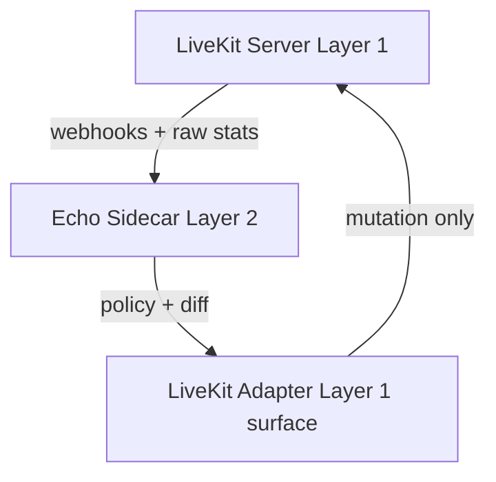

# Layer 1 — LiveKit VC Infrastructure Plan

**Status:** Shipped (Layer 1 VC); see operational notes in [`docs/plans/livekit-vc-layer-1-progress.md`](../../plans/livekit-vc-layer-1-progress.md).
**Date:** 2026-04-04 (architecture); implementation status tracked in the progress doc.
**Prerequisite reading:** [`ECHO_VOICE_INTELLIGENCE_LAYER.md`](./ECHO_VOICE_INTELLIGENCE_LAYER.md) (Layer 2 - Voice Intelligence).

---

## 0. Purpose of Layer 1

Layer 1 is NOT “voice intelligence” or “optimization”.

It is a **stable, predictable, transport-grade WebRTC system** that exposes a clean control surface for Echo to operate on.

It must be:

- deterministic
- boring
- low-variance
- easy to reason about under load

Echo (Layer 2) assumes Layer 1 behaves like a dumb, stable media substrate.

---

## 1. Hard boundary (most important rule)

Layer 1 must guarantee:
**LiveKit owns all media behavior. Echo never touches packet-level logic.**

So Layer 1 must explicitly expose ONLY:

**Allowed control surface:**

- room creation / deletion
- participant join / leave
- subscription preferences (coarse)
- track mute / unmute
- max layer hints (optional)
- basic room metadata

**Forbidden from Layer 1 perspective:**

- any dynamic “intelligence”
- per-packet or per-frame control logic
- adaptive policy systems
- any attempt to “outsmart Echo”

**Layer 1 is NOT allowed to become Layer 2 over time.**

---

## 2. Layer 1 architecture (what you actually build)

### 2.1 Components

#### (A) LiveKit Server (core SFU)

- handles WebRTC media routing
- runs simulcast/SVC
- handles congestion control internally
- exposes SDK + REST APIs

#### (B) Voice Node (hosting layer)

This is your infrastructure wrapper around LiveKit:
_Responsibilities:_

- run LiveKit server (single-node initially)
- expose WebRTC ports (UDP + TCP fallback)
- host TURN (optional or external)
- expose webhook endpoint to Echo API
- expose internal admin endpoints (health, stats)
  _Nothing else._

#### (C) Token Service (inside Echo API, NOT voice node)

- mints LiveKit join tokens
- embeds permissions + room metadata
- enforces RBAC before join
  **Layer 1 must NOT decide permissions.**

#### (D) Webhook Receiver (inside voice node OR reverse proxy)

Receives LiveKit events:

- participant joined
- participant left
- track published/unpublished
- active speaker events
  Then forwards to Echo sidecar.
  **No interpretation. Just forwarding.**

---

## 3. Room model (must match Echo expectations)

Each LiveKit room = 1 Echo voice channel

**Room naming rule:**
`serverId:channelId` (e.g., `server_123:channel_456`)

**Room constraints (fixed baseline)**
These are IMPORTANT because Echo assumes stability:

- **max participants:** configurable per channel (default 50–200)
- **audio:** always enabled
- **video:** optional per user
- **data channel:** enabled (for Echo telemetry only)
- **simulcast:** enabled for video tracks
- **SVC:** enabled if codec supports it

---

## 4. Media configuration (critical baseline defaults)

Layer 1 must ship with stable defaults:

**Audio**

- codec: Opus
- sample rate: 48kHz
- priority: always highest stability

**Video**

- simulcast enabled
- 3 layers (low / mid / high)
- default adaptive bitrate ON (LiveKit owns it)

**Network**

- TURN enabled for strict NAT users
- ICE restart enabled
- reconnect window: generous (>= 30s)

---

## 5. Connection lifecycle (must be deterministic)

**Join flow (strict order)**

1. Echo API validates user
2. Echo API mints LiveKit token
3. Client connects to LiveKit node
4. LiveKit creates participant
5. Webhook fires → Echo sidecar updates state

**Leave flow**

1. Client disconnects OR times out
2. LiveKit emits `participant_left`
3. Webhook updates Echo state
4. Echo reconciles participant table

**Reconnect behavior**
Layer 1 must guarantee:

- session resumption allowed
- no duplicate participant explosion
- stale sessions auto-cleaned

---

## 6. Webhook contract (VERY important for Echo)

Layer 1 must emit these events reliably:

- `participant_joined`
- `participant_left`
- `track_published`
- `track_unpublished`
- `active_speakers_changed`
- `room_metadata_changed` (optional)

**Rule:** Webhook must be source-of-truth for real-time state sync. Echo NEVER polls LiveKit as primary signal.

---

## 7. Scaling model (Layer 1 responsibility)

Even in single-node phase, design must assume:

**Phase 1 (your current target)**

- 1 LiveKit node
- multiple rooms
- no region routing

**Phase 2 ready design (must not require rewrite)**

- multiple LiveKit nodes
- room-to-node assignment layer
- stateless Echo sidecar per node OR centralized

**Required abstraction:** Layer 1 must NOT assume single node internally.

---

## 8. Failure handling (Layer 1 scope only)

Layer 1 must guarantee these behaviors:

**If LiveKit crashes:**

- reconnect clients automatically
- rooms recover on restart (if possible)
- Echo sidecar rebuilds state from LiveKit API

**If webhook fails:**

- Echo can rebuild from LiveKit `ListParticipants`
- no permanent state loss

**If node is overloaded:**

- degrade connection quality via LiveKit (not Echo)
- Echo is not responsible for recovery here

---

## 9. Control surface exposure (what Echo is allowed to touch)

Layer 1 exposes ONLY via adapter:

- `createRoom`
- `deleteRoom`
- `mintToken`
- `applySubscriptionPolicy`
- `muteTrack`
- `listParticipants`
- `getRoomStats`

**Hard rule:** Layer 1 does NOT contain business logic about WHO gets what. That belongs entirely to Echo.

---

## 10. Observability (Layer 1 responsibility only)

Must expose raw infrastructure metrics:

- active connections
- bandwidth usage per room
- CPU load per SFU node
- packet loss (raw)
- RTT (raw)
- reconnections
- TURN usage

**IMPORTANT:** No interpretation (no Healthy/Degraded/Critical here). Those are Layer 2 concepts only.

---

## 11. Security model

Layer 1 must enforce:

- token-based authentication only
- short-lived JWT tokens (LiveKit format)
- no direct client access without token
- webhook signature validation
- no public admin endpoints

---

## 12. What Layer 1 explicitly must NOT do

This is critical to prevent architecture collapse:

- NO bandwidth tier logic
- NO prioritization logic
- NO “smart” participant handling
- NO adaptive subscription policies beyond static defaults
- NO smoothing or heuristics
- NO decision making

If it starts doing this → you are rebuilding Echo inside LiveKit layer.

---

## 13. How Layer 1 + Layer 2 connect

**Flow:**

**Key idea:** Layer 1 is dumb runtime. Layer 2 is intelligence. Adapter is glue.

---

## 14. Minimal MVP scope (what dev should actually build first)

**P0 (must ship first)**

- LiveKit single node running
- token minting in Echo API
- client connects audio-only
- basic join/leave lifecycle
- webhook forwarding to Echo

**P1**

- video support (simulcast enabled)
- room mapping (`serverId:channelId`)
- participant tracking sync
- reconnect handling

**P2**

- stats exposure endpoint
- TURN integration hardening
- multi-room load validation
- prep for multi-node

---

## Final summary (very important)

**Layer 1** is a deterministic WebRTC infrastructure layer that behaves like a predictable transport engine with a minimal control API.

**Layer 2** is everything intelligent, adaptive, and experience-driven.
