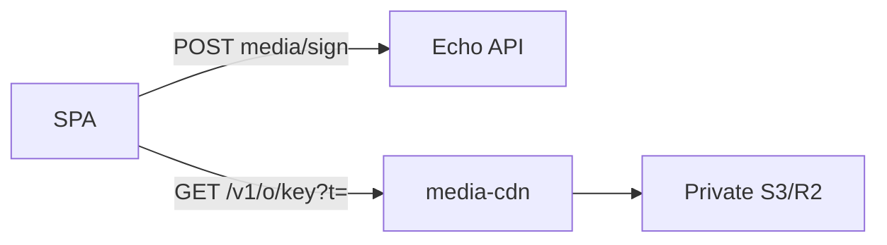

# Media CDN (signed delivery sidecar)

Echo’s upload path is unchanged: clients still `POST /uploads/presign`, `PUT` to S3/R2, then register. **Reads** can move to the `media-cdn` sidecar with HMAC-signed, scoped GET URLs.

## Architecture

| Layer         | Responsibility                                                                                   |
| ------------- | ------------------------------------------------------------------------------------------------ |
| **Echo API**  | RBAC at sign time (`POST /api/v1/echo/media/sign`), canonical URL generation in presign/register |
| **media-cdn** | Verify HMAC + stream bytes from private S3/R2 (or local disk in dev)                             |
| **SPA**       | Batch-sign visible attachments before `` / `<video>` / `fetch`                              |



## Enable (production)

1. **Private bucket** — disable public R2 dev URL; objects are only reachable via `media-cdn` or API workers.
2. **Deploy `media-cdn`** on `media.<your-domain>` (reverse proxy → port `3010` by default).
3. **Echo API env** (see [`.env.example`](../../.env.example)):
   - `ECHO_MEDIA_CDN_ENABLED=true`
   - `ECHO_MEDIA_CDN_BASE_URL=https://media.example.com`
   - `ECHO_MEDIA_CDN_SIGNING_SECRET` — ≥ 32 chars, independent of `JWT_SECRET` / `LOCAL_UPLOAD_TOKEN_SECRET`
   - Same `ECHO_S3_*` credentials as the API (sidecar uses `GetObject`)

4. **Sidecar env** (same host or separate process):
   - `ECHO_MEDIA_CDN_SIGNING_SECRET` (must match API)
   - `ECHO_S3_BUCKET`, `ECHO_S3_REGION`, `ECHO_S3_ACCESS_KEY`, `ECHO_S3_SECRET_KEY`, optional `ECHO_S3_ENDPOINT`
   - `ECHO_MEDIA_CDN_PORT=3010`, `ECHO_MEDIA_CDN_HOST=127.0.0.1`

5. **Frontend build** (optional): `VITE_MEDIA_CDN_BASE_URL=https://media.example.com`

## Commands

```bash
npm run dev -w media-cdn    # local sidecar
npm run test -w media-cdn   # sidecar unit tests
```

## Signing API

`POST /api/v1/echo/media/sign`

- **Body:** `{ items: [{ storageKey?, publicUrl?, scope?: "object" | "prefix" }] }` (max 20)
- **Auth:** session required for private keys; public branding / `echo/public-emojis/` keys are rate-limited by IP only
- **Response:** `{ urls: [{ storageKey, url, expiresAt, scope }] }` — `url` includes `?t=` HMAC token

**HLS:** sign with `scope: "prefix"` and `storageKey` set to `{sourceKey}/hls` (no trailing segment filename) so playlist segment URLs work.

**Legacy:** `POST /uploads/read-token` remains as a thin wrapper; prefer `/media/sign`.

## Migration

1. Deploy sidecar + set `ECHO_MEDIA_CDN_BASE_URL`; keep `ECHO_S3_PUBLIC_READ_THROUGH_API` as fallback during soak.
2. New uploads get canonical CDN paths (no embedded token).
3. SPA signs on read for old R2/read-through URLs via `storageKey` extraction.
4. After soak: private bucket, `ECHO_MEDIA_CDN_ENABLED=true`, disable public R2 URL.
5. Later: remove read-through routes when traffic is gone.

## Cache-Control (sidecar)

| Prefix                                                              | Header                                |
| ------------------------------------------------------------------- | ------------------------------------- |
| `echo/server-icons/`, `echo/server-banners/`, `echo/public-emojis/` | `public, max-age=31536000, immutable` |
| `*/hls/*.m4s`, `*/hls/*.ts`                                         | `public, max-age=86400`               |
| Chat / private uploads                                              | `private, max-age=300`                |

## CSP

The SPA CSP already allows `https:` for `img-src` / `media-src`. When tightening CSP, allow your `ECHO_MEDIA_CDN_BASE_URL` explicitly.

## Explore / OG tags

Server icons/banners need unauthenticated sign (public audience + IP rate limit) or server-side sign at HTML render time. Do not embed long-lived tokens in persisted message JSON — use canonical paths + client sign.

## Health / metrics

- `GET /healthz`
- `GET /metrics` (Prometheus)
