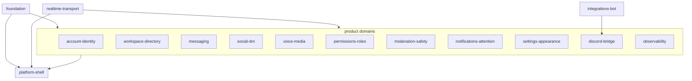

# Echo monorepo domain map (single source of truth)

This document is the **authoritative** boundary reference for architecture and refactors. Every asset below has **exactly one primary domain** (slug in backticks). If code appears to belong to two domains, **this map wins**: split the module or re-home it, then update this file in the same change.

Cross-cutting behavior may be described in prose as _touching_ another domain; that is **not** a second owner.

**Inventory scope:** Tracked paths only (`git ls-files`). Untracked or local-only files are out of scope until added to the repository.

---

## Governance

1. Any change that introduces a **new** Pinia store, `clients/web/src/features/<name>/` top-level folder, root-level composable (`clients/web/src/composables/*.ts`), API module, or route file **must** update this document in the same PR.
2. Moves or renames of mapped files **must** update the relevant rows here; no follow-up “docs PR”.
3. Product domains may depend on `foundation` and `realtime-transport`. Product domains **must not** import `platform-shell` internals. `platform-shell` composes product domains through stable seams (props, orchestration services, small public feature APIs), per `[clients/web/src/features/README.md](../../clients/web/src/features/README.md)`.
4. Service layering rules in `[clients/web/src/services/README.md](../../clients/web/src/services/README.md)` apply **within** each domain’s orchestration; this map assigns **which domain owns** each file.

---

## Dependency overview

---

## Domain catalog

| Slug                      | Charter                                                                                                                                                                                           | Allowed outbound deps (primary)                                                     | Key backend mirror                                                                                                                                                                                                                                                                                                                                                                                                                                                                                                                                                                                                                                                                                 |
| ------------------------- | ------------------------------------------------------------------------------------------------------------------------------------------------------------------------------------------------- | ----------------------------------------------------------------------------------- | -------------------------------------------------------------------------------------------------------------------------------------------------------------------------------------------------------------------------------------------------------------------------------------------------------------------------------------------------------------------------------------------------------------------------------------------------------------------------------------------------------------------------------------------------------------------------------------------------------------------------------------------------------------------------------------------------- |
| `account-identity`        | Authentication, session, guest flows, 2FA, passkeys, password recovery, account “me” security.                                                                                                    | `foundation`, `realtime-transport`                                                  | `[server/backend/src/api/routes/auth/](../../server/backend/src/api/routes/auth/)`, `[server/backend/src/auth/](../../server/backend/src/auth/)`                                                                                                                                                                                                                                                                                                                                                                                                                                                                                                                                                   |
| `workspace-directory`     | Guild list, channel tree, categories, invites, explore/directory, workspace hydration snapshot (servers, members, discoverable servers). _Touches_ messaging for read receipts / channel context. | `foundation`, `realtime-transport`                                                  | `[echoServers.ts](../../server/backend/src/api/routes/echo/servers.ts)`, `[echoCategories.ts](../../server/backend/src/api/routes/echo/categories.ts)`, `[echoChannels.ts](../../server/backend/src/api/routes/echo/channels.ts)`, `[echoInvites.ts](../../server/backend/src/api/routes/echo/invites.ts)`, `[echoPublic.ts](../../server/backend/src/api/routes/echo/public.ts)`, `[server/backend/src/domain/echoStore/servers/servers.ts](../../server/backend/src/domain/echoStore/servers/servers.ts)`, `[categoriesWorkspace.ts](../../server/backend/src/domain/echoStore/channels/categoriesWorkspace.ts)`, `[invites.ts](../../server/backend/src/domain/echoStore/community/invites.ts)` |
| `messaging`               | Messages, edits, deletes, history, search, pins, reactions, typing, client message index, send pipeline, in-chat markdown.                                                                        | `foundation`, `realtime-transport`                                                  | `[echoMessages.ts](../../server/backend/src/api/routes/echo/messages.ts)`, `[echoMessageSearch.ts](../../server/backend/src/api/routes/echo/messageSearch.ts)`, `[channelPinsPersistence.ts](../../server/backend/src/domain/echoStore/channels/channelPinsPersistence.ts)`, `[messageOps.ts](../../server/backend/src/domain/echoStore/messages/messageOps.ts)`, `[messageReactionPersistence.ts](../../server/backend/src/domain/echoStore/messages/messageReactionPersistence.ts)`, `[userTypingProfile.ts](../../server/backend/src/domain/echoStore/members/userTypingProfile.ts)`                                                                                                            |
| `social-dm`               | Friends, requests, blocks, DM threads, message requests, DM/group DM call UX.                                                                                                                     | `foundation`, `realtime-transport`                                                  | `[echoSocial.ts](../../server/backend/src/api/routes/echo/social.ts)`, `[echoDm.ts](../../server/backend/src/api/routes/echo/dm.ts)`, `[social.ts](../../server/backend/src/domain/echoStore/social/social.ts)`, `[dmThreads.ts](../../server/backend/src/domain/echoStore/social/dmThreads.ts)`, `[blocks.ts](../../server/backend/src/domain/echoStore/members/blocks.ts)`                                                                                                                                                                                                                                                                                                                       |
| `voice-media`             | Voice channels, LiveKit, media uploads, attachments, emoji/GIF libraries, A/V device prefs, Krisp, ringtone playback _infrastructure_.                                                            | `foundation`, `realtime-transport`                                                  | `[echoVoice.ts](../../server/backend/src/api/routes/echo/voice.ts)`, `[echoUploads.ts](../../server/backend/src/api/routes/echo/uploads.ts)`, `[echoEmojiLibrary.ts](../../server/backend/src/api/routes/echo/emojiLibrary.ts)`, `[voice.ts](../../server/backend/src/domain/echoStore/voice/voice.ts)`, `[emojiLibrary.ts](../../server/backend/src/domain/echoStore/emoji/emojiLibrary.ts)`                                                                                                                                                                                                                                                                                                      |
| `permissions-roles`       | Roles, aggregates, permission overwrites, explain/preview, server settings areas that are RBAC-first.                                                                                             | `foundation`, `realtime-transport`                                                  | `[echoRoles.ts](../../server/backend/src/api/routes/echo/roles.ts)`, `[echoPermissionOverwrites.ts](../../server/backend/src/api/routes/echo/permissionOverwrites.ts)`, `[echoServerScoped.ts](../../server/backend/src/api/routes/echo/serverScoped.ts)`, `[echoPermissionEvaluate.ts](../../server/backend/src/domain/permissions/echoPermissionEvaluate.ts)`, `[roles.ts](../../server/backend/src/domain/echoStore/roles/roles.ts)`, `[permissionOverwrites.ts](../../server/backend/src/domain/echoStore/roles/permissionOverwrites.ts)`, `[permissions.ts](../../server/backend/src/domain/echoStore/roles/permissions.ts)`                                                                  |
| `moderation-safety`       | Kicks, bans, timeouts, automod/raid toggles, audit log, safety endpoints.                                                                                                                         | `foundation`, `realtime-transport`                                                  | `[echoModeration.ts](../../server/backend/src/api/routes/echo/moderation.ts)`, `[echoSafety.ts](../../server/backend/src/api/routes/echo/safety.ts)`, `[moderation.ts](../../server/backend/src/domain/echoStore/safety/moderation.ts)`, `[auditLog.ts](../../server/backend/src/domain/echoStore/safety/auditLog.ts)`                                                                                                                                                                                                                                                                                                                                                                             |
| `notifications-attention` | Unread/mention attention, server notification prefs, ping UX.                                                                                                                                     | `foundation`, `realtime-transport`                                                  | `[attention.ts](../../server/backend/src/domain/echoStore/social/attention.ts)`, `[serverNotificationPreferences.ts](../../server/backend/src/domain/echoStore/servers/serverNotificationPreferences.ts)`                                                                                                                                                                                                                                                                                                                                                                                                                                                                                          |
| `settings-appearance`     | User settings surfaces (appearance, sounds, legal, formatting guides) distinct from guild admin modals.                                                                                           | `foundation`, `realtime-transport`, other product domains via thin API clients only | (mostly frontend; backend pieces split per API table)                                                                                                                                                                                                                                                                                                                                                                                                                                                                                                                                                                                                                                              |
| `discord-bridge`          | Discord OAuth, import, me-Discord linking, bot hooks.                                                                                                                                             | `foundation`, `realtime-transport`                                                  | `[discordOAuth.ts](../../server/backend/src/api/routes/discordOAuth.ts)`, `[meDiscord.ts](../../server/backend/src/api/routes/meDiscord.ts)`, `[echoDiscordImport.ts](../../server/backend/src/api/routes/echo/discordImport.ts)`, `[discordBotHook.ts](../../server/backend/src/api/routes/discordBotHook.ts)`, `[discordImport.ts](../../server/backend/src/services/discordImport/discordImport.ts)`                                                                                                                                                                                                                                                                                            |
| `platform-shell`          | App shell composition: layout controller, URL sync, rails, modals host wiring, workspace lifecycle orchestration entrypoints.                                                                     | `foundation`, `realtime-transport`, all product domains via seams                   | `[bootstrap/startServer.ts](../../server/backend/src/bootstrap/startServer.ts)` is not shell—see `foundation`                                                                                                                                                                                                                                                                                                                                                                                                                                                                                                                                                                                      |
| `realtime-transport`      | WebSocket client/server transport, connection lifecycle, transport-shaped diagnostics.                                                                                                            | `foundation`                                                                        | `[server/backend/src/bootstrap/socket.ts](../../server/backend/src/bootstrap/socket.ts)`, `[server/backend/src/sockets/](../../server/backend/src/sockets/)`                                                                                                                                                                                                                                                                                                                                                                                                                                                                                                                                       |
| `observability`           | Diagnostics, bug reports, dev tracing, metrics hooks.                                                                                                                                             | `foundation`                                                                        | `[devDiagnostics.ts](../../server/backend/src/api/routes/devDiagnostics.ts)`, `[echoBugReports.ts](../../server/backend/src/api/routes/echo/bugReports.ts)`, `[server/backend/src/observability/](../../server/backend/src/observability/)`                                                                                                                                                                                                                                                                                                                                                                                                                                                        |
| `foundation`              | Shared contracts, generic HTTP helpers, cross-cutting utilities with **no** single product owner, DB/bootstrap glue.                                                                              | `foundation` only                                                                   | `[contracts/](../../contracts/)`, `[server/backend/src/db/](../../server/backend/src/db/)`                                                                                                                                                                                                                                                                                                                                                                                                                                                                                                                                                                                                         |
| `integrations-bot`        | Discord export bot and tooling.                                                                                                                                                                   | `foundation`, `discord-bridge` _data contracts only_                                | `[bot/src](../../bot/src)`                                                                                                                                                                                                                                                                                                                                                                                                                                                                                                                                                                                                                                                                         |

### Explicit ownership overrides (global state)

| Asset                                               | Primary domain            | Note                                                               |
| --------------------------------------------------- | ------------------------- | ------------------------------------------------------------------ |
| `useEchoSessionStore` / hydrated workspace snapshot | `workspace-directory`     | Includes `presenceByUserId` materialization; consumed by many UIs. |
| `useServerStore`                                    | `workspace-directory`     | Facade over echo session for server rail / ordering.               |
| `messageIndex` store                                | `messaging`               | Client-side channel message indexes.                               |
| `echoAttention` store                               | `notifications-attention` | Unread/mention map.                                                |
| `channelTyping` store                               | `messaging`               | Typing indicators are channel/chat affordances.                    |

---

## Pinia stores (`clients/web/src/stores/`)

| Path                                                           | Domain                    |
| -------------------------------------------------------------- | ------------------------- |
| `clients/web/src/features/auth/authSession.ts`                 | `account-identity`        |
| `clients/web/src/features/layout/bugHunter.ts`                 | `observability`           |
| `clients/web/src/features/voice/callRingtone.ts`               | `voice-media`             |
| `clients/web/src/features/voice/cameraPreferences.ts`          | `voice-media`             |
| `clients/web/src/features/chat/channelTyping.ts`               | `messaging`               |
| `clients/web/src/features/dev/devSettings.ts`                  | `observability`           |
| `clients/web/src/features/layout/echoAttention.ts`             | `notifications-attention` |
| `clients/web/src/features/layout/echoAttention.test.ts`        | `notifications-attention` |
| `clients/web/src/features/layout/echoSession.ts`               | `workspace-directory`     |
| `clients/web/src/stores/messageIndex.ts`                       | `messaging`               |
| `clients/web/src/features/settings/notificationPreferences.ts` | `notifications-attention` |
| `clients/web/src/features/layout/server.ts`                    | `workspace-directory`     |
| `clients/web/src/features/settings/themeStore.ts`              | `settings-appearance`     |
| `clients/web/src/features/settings/uiAudioDevices.ts`          | `voice-media`             |
| `clients/web/src/features/voice/voiceLevels.ts`                | `voice-media`             |
| `clients/web/src/features/voice/voiceLevels.test.ts`           | `voice-media`             |

---

## Frontend API clients (`clients/web/src/api/`)

| Path                                                | Domain                    |
| --------------------------------------------------- | ------------------------- |
| `clients/web/src/api/client.ts`                     | `foundation`              |
| `clients/web/src/api/authClient.ts`                 | `account-identity`        |
| `clients/web/src/api/authClient.loginParse.test.ts` | `account-identity`        |
| `clients/web/src/api/meClient.ts`                   | `account-identity`        |
| `clients/web/src/api/echoClient.ts`                 | `foundation`              |
| `clients/web/src/api/echoClient.test.ts`            | `foundation`              |
| `clients/web/src/api/echoSearchParams.ts`           | `foundation`              |
| `clients/web/src/api/echoSearchParams.test.ts`      | `foundation`              |
| `clients/web/src/api/echo/attention.ts`             | `notifications-attention` |
| `clients/web/src/api/echo/bugReports.ts`            | `observability`           |
| `clients/web/src/api/echo/categories.ts`            | `workspace-directory`     |
| `clients/web/src/api/echo/channels.ts`              | `workspace-directory`     |
| `clients/web/src/api/echo/discordImport.ts`         | `discord-bridge`          |
| `clients/web/src/api/echo/emoji.ts`                 | `voice-media`             |
| `clients/web/src/api/echo/guild.ts`                 | `workspace-directory`     |
| `clients/web/src/api/echo/invitesAndDirectory.ts`   | `workspace-directory`     |
| `clients/web/src/api/echo/messages.ts`              | `messaging`               |
| `clients/web/src/api/echo/moderation.ts`            | `moderation-safety`       |
| `clients/web/src/api/echo/permissions.ts`           | `permissions-roles`       |
| `clients/web/src/api/echo/serverAdmin.ts`           | `permissions-roles`       |
| `clients/web/src/api/echo/serverLifecycle.ts`       | `workspace-directory`     |
| `clients/web/src/api/echo/social.ts`                | `social-dm`               |
| `clients/web/src/api/echo/transport.ts`             | `foundation`              |
| `clients/web/src/api/echo/transport.test.ts`        | `foundation`              |
| `clients/web/src/api/echo/types.ts`                 | `foundation`              |
| `clients/web/src/api/echo/uploads.ts`               | `voice-media`             |
| `clients/web/src/api/echo/voice.ts`                 | `voice-media`             |
| `clients/web/src/api/echo/workspace.ts`             | `workspace-directory`     |

---

## Frontend services (`clients/web/src/services/`)

| Path                                                                                   | Domain                |
| -------------------------------------------------------------------------------------- | --------------------- |
| `clients/web/src/services/README.md`                                                   | `foundation`          |
| `clients/web/src/services/index.ts`                                                    | `foundation`          |
| `clients/web/src/features/layout/echoWorkspace/echoApi.ts`                             | `foundation`          |
| `clients/web/src/features/chat/domain/composer.ts`                                     | `messaging`           |
| `clients/web/src/features/chat/domain/permissions.ts`                                  | `permissions-roles`   |
| `clients/web/src/features/layout/presence.ts`                                          | `workspace-directory` |
| `clients/web/src/services/orchestration/workspaceAuthUserRoster.ts`                    | `workspace-directory` |
| `clients/web/src/features/layout/echoWorkspace/workspaceFirstGuildBootstrapGuard.ts`   | `workspace-directory` |
| `clients/web/src/features/layout/echoWorkspace/workspaceFriendIdsByUserId.ts`          | `workspace-directory` |
| `clients/web/src/features/layout/echoWorkspace/workspaceHydrateSkipLatch.ts`           | `workspace-directory` |
| `clients/web/src/features/layout/echoWorkspace/workspaceEchoHydrateFromApi.ts`         | `workspace-directory` |
| `clients/web/src/features/layout/echoWorkspace/workspaceEchoApiSnapshot.ts`            | `workspace-directory` |
| `clients/web/src/services/orchestration/workspaceRosterMerge.ts`                       | `workspace-directory` |
| `clients/web/src/features/layout/echoWorkspace/workspaceServerDeletionNav.ts`          | `workspace-directory` |
| `clients/web/src/features/layout/echoWorkspace/workspaceShellResetOnLogout.ts`         | `workspace-directory` |
| `clients/web/src/features/layout/echoWorkspace/workspaceSocialHydrate.ts`              | `workspace-directory` |
| `clients/web/src/features/layout/realtime/workspaceSocketEventHandler.ts`              | `workspace-directory` |
| `clients/web/src/features/chat/sendIntent.ts`                                          | `messaging`           |
| `clients/web/src/features/server-settings/domain/serverSettings.ts`                    | `permissions-roles`   |
| `clients/web/src/services/domain/__tests__/composer.test.ts`                           | `messaging`           |
| `clients/web/src/services/domain/__tests__/permissions.test.ts`                        | `permissions-roles`   |
| `clients/web/src/services/domain/__tests__/presence.test.ts`                           | `workspace-directory` |
| `clients/web/src/services/domain/__tests__/workspaceAuthUserRoster.test.ts`            | `workspace-directory` |
| `clients/web/src/services/domain/__tests__/workspaceFirstGuildBootstrapGuard.test.ts`  | `workspace-directory` |
| `clients/web/src/services/domain/__tests__/workspaceFriendIdsByUserId.test.ts`         | `workspace-directory` |
| `clients/web/src/services/domain/__tests__/workspaceHydrateSkipLatch.test.ts`          | `workspace-directory` |
| `clients/web/src/services/orchestration/__tests__/workspaceEchoHydrateFromApi.test.ts` | `workspace-directory` |
| `clients/web/src/services/domain/__tests__/workspaceEchoApiSnapshot.test.ts`           | `workspace-directory` |
| `clients/web/src/services/domain/__tests__/workspaceRosterMerge.test.ts`               | `workspace-directory` |
| `clients/web/src/services/orchestration/__tests__/workspaceServerDeletionNav.test.ts`  | `workspace-directory` |
| `clients/web/src/services/orchestration/__tests__/workspaceShellResetOnLogout.test.ts` | `workspace-directory` |
| `clients/web/src/services/domain/__tests__/workspaceSocialHydrate.test.ts`             | `workspace-directory` |
| `clients/web/src/services/domain/__tests__/workspaceSocketEventHandler.test.ts`        | `workspace-directory` |
| `clients/web/src/services/domain/__tests__/sendIntent.test.ts`                         | `messaging`           |
| `clients/web/src/features/layout/realtime/appEchoRealtimeHost.ts`                      | `platform-shell`      |
| `clients/web/src/services/orchestration/__tests__/appEchoRealtimeHost.test.ts`         | `platform-shell`      |
| `clients/web/src/features/layout/appLayoutService.ts`                                  | `platform-shell`      |
| `clients/web/src/features/chat/send/sendOrchestration.ts`                              | `messaging`           |
| `clients/web/src/features/server-settings/serverSettingsOrchestration.ts`              | `permissions-roles`   |
| `clients/web/src/features/voice/voiceService.ts`                                       | `voice-media`         |
| `clients/web/src/features/voice/voiceRouting.ts`                                       | `voice-media`         |
| `clients/web/src/features/layout/echoWorkspace/workspaceLifecycle.ts`                  | `platform-shell`      |
| `clients/web/src/services/orchestration/__tests__/send.test.ts`                        | `messaging`           |
| `clients/web/src/services/orchestration/__tests__/voice.test.ts`                       | `voice-media`         |
| `clients/web/src/features/chat/send/sendService.ts`                                    | `messaging`           |
| `clients/web/src/services/send/__tests__/send.test.ts`                                 | `messaging`           |
| `clients/web/src/features/layout/realtime/socketAdapter.ts`                            | `realtime-transport`  |
| `clients/web/src/features/layout/realtime/storeAdapters.ts`                            | `foundation`          |
| `clients/web/src/features/layout/realtime/echoRealtimePort.ts`                         | `realtime-transport`  |
| `clients/web/src/features/layout/realtime/echoSocketInboundListeners.ts`               | `realtime-transport`  |
| `clients/web/src/services/realtime/echoSocketMessageStoreBridge.ts`                    | `realtime-transport`  |
| `clients/web/src/features/layout/realtime/echoSocketComposableEffects.ts`              | `realtime-transport`  |
| `clients/web/src/features/layout/realtime/echoSocketRealtimeWiring.ts`                 | `realtime-transport`  |
| `clients/web/src/features/chat/send/echoSocketSendMessage.ts`                          | `realtime-transport`  |
| `clients/web/src/features/layout/realtime/echoSocketSessionLifecycle.ts`               | `realtime-transport`  |
| `clients/web/src/features/layout/realtime/echoSocketSubmitEmits.ts`                    | `realtime-transport`  |
| `clients/web/src/services/realtime/echoSocketUiTransactions.ts`                        | `realtime-transport`  |
| `clients/web/src/services/realtime/__tests__/echoSocketComposableEffects.test.ts`      | `realtime-transport`  |
| `clients/web/src/services/realtime/__tests__/echoSocketMessageStoreBridge.test.ts`     | `realtime-transport`  |
| `clients/web/src/features/layout/realtime/socketChannelTypingIngest.ts`                | `realtime-transport`  |
| `clients/web/src/services/realtime/__tests__/socketChannelTypingIngest.test.ts`        | `realtime-transport`  |
| `clients/web/src/features/layout/realtime/socketConnectErrorIngest.ts`                 | `realtime-transport`  |
| `clients/web/src/services/realtime/__tests__/socketConnectErrorIngest.test.ts`         | `realtime-transport`  |
| `clients/web/src/services/realtime/socketUnexpectedDisconnectUi.ts`                    | `realtime-transport`  |
| `clients/web/src/services/realtime/__tests__/socketUnexpectedDisconnectUi.test.ts`     | `realtime-transport`  |
| `clients/web/src/features/layout/realtime/socketInbound.ts`                            | `realtime-transport`  |
| `clients/web/src/services/realtime/socketIncomingChatNotify.ts`                        | `realtime-transport`  |
| `clients/web/src/services/realtime/__tests__/socketIncomingChatNotify.test.ts`         | `realtime-transport`  |
| `clients/web/src/features/chat/ingest/socketIncomingLiveMessage.ts`                    | `realtime-transport`  |
| `clients/web/src/services/realtime/__tests__/socketIncomingLiveMessage.test.ts`        | `realtime-transport`  |
| `clients/web/src/features/chat/ingest/socketMessageAckApply.ts`                        | `realtime-transport`  |
| `clients/web/src/services/realtime/__tests__/socketMessageAckApply.test.ts`            | `realtime-transport`  |
| `clients/web/src/features/chat/ingest/socketRemoteMessagePatchApply.ts`                | `realtime-transport`  |
| `clients/web/src/services/realtime/__tests__/socketRemoteMessagePatchApply.test.ts`    | `realtime-transport`  |
| `clients/web/src/features/chat/ingest/socketMessageFailedIngest.ts`                    | `realtime-transport`  |
| `clients/web/src/services/realtime/__tests__/socketMessageFailedIngest.test.ts`        | `realtime-transport`  |
| `clients/web/src/features/layout/realtime/socketPollVoteFailed.ts`                     | `realtime-transport`  |
| `clients/web/src/services/realtime/__tests__/socketPollVoteFailed.test.ts`             | `realtime-transport`  |
| `clients/web/src/features/chat/ingest/socketIncomingRawMessage.ts`                     | `realtime-transport`  |
| `clients/web/src/services/realtime/__tests__/socketIncomingRawMessage.test.ts`         | `realtime-transport`  |
| `clients/web/src/features/layout/realtime/socketOutbound.ts`                           | `realtime-transport`  |
| `clients/web/src/features/layout/realtime/socketOutboundPlainTextChunks.ts`            | `realtime-transport`  |
| `clients/web/src/features/chat/send/socketOutboundChunkedChatSend.ts`                  | `realtime-transport`  |
| `clients/web/src/features/chat/send/socketOutboundPollSend.ts`                         | `realtime-transport`  |
| `clients/web/src/features/chat/send/socketOutboundChatSend.ts`                         | `realtime-transport`  |
| `clients/web/src/features/chat/send/socketOutboundSendPreflight.ts`                    | `realtime-transport`  |
| `clients/web/src/services/realtime/__tests__/socketOutboundPlainTextChunks.test.ts`    | `realtime-transport`  |
| `clients/web/src/services/realtime/__tests__/socketOutboundChunkedChatSend.test.ts`    | `realtime-transport`  |
| `clients/web/src/services/realtime/__tests__/socketOutboundPollSend.test.ts`           | `realtime-transport`  |
| `clients/web/src/services/realtime/__tests__/socketOutboundChatSend.test.ts`           | `realtime-transport`  |
| `clients/web/src/services/realtime/__tests__/socketOutboundSendPreflight.test.ts`      | `realtime-transport`  |
| `clients/web/src/features/chat/ingest/socketPendingClientMessages.ts`                  | `realtime-transport`  |
| `clients/web/src/services/realtime/__tests__/socketPendingClientMessages.test.ts`      | `realtime-transport`  |
| `clients/web/src/features/layout/realtime/socketPresenceSession.ts`                    | `realtime-transport`  |
| `clients/web/src/services/realtime/__tests__/socketPresenceSession.test.ts`            | `realtime-transport`  |
| `clients/web/src/features/layout/realtime/socketTransport.ts`                          | `realtime-transport`  |
| `clients/web/src/services/realtime/socketConnectBootstrap.ts`                          | `realtime-transport`  |
| `clients/web/src/features/layout/realtime/socketClientResumeAndWindow.ts`              | `realtime-transport`  |
| `clients/web/src/features/layout/realtime/socketIoSessionWire.ts`                      | `realtime-transport`  |
| `clients/web/src/features/layout/realtime/socketConnectOrchestrator.ts`                | `realtime-transport`  |
| `clients/web/src/services/realtime/__tests__/socketConnectBootstrap.test.ts`           | `realtime-transport`  |
| `clients/web/src/services/realtime/__tests__/socketClientResumeAndWindow.test.ts`      | `realtime-transport`  |
| `clients/web/src/services/realtime/__tests__/socketIoSessionWire.test.ts`              | `realtime-transport`  |
| `clients/web/src/services/realtime/__tests__/socketConnectOrchestrator.test.ts`        | `realtime-transport`  |
| `clients/web/src/features/voice/livekit/krispNoiseFilter.ts`                           | `voice-media`         |
| `clients/web/src/features/voice/livekit/krispNoiseFilter.test.ts`                      | `voice-media`         |
| `clients/web/src/features/voice/livekit/livekitTrackAdapter.ts`                        | `voice-media`         |

---

## Shared composables (`clients/web/src/composables/`)

| Path                                                                                | Domain                |
| ----------------------------------------------------------------------------------- | --------------------- |
| `clients/web/src/features/chat/markdown/markdownMathRegions.ts`                     | `messaging`           |
| `clients/web/src/features/chat/markdown/markdownMathRegions.test.ts`                | `messaging`           |
| `clients/web/src/features/chat/markdown/normalizeKatexInput.ts`                     | `messaging`           |
| `clients/web/src/features/chat/markdown/normalizeKatexInput.test.ts`                | `messaging`           |
| `clients/web/src/features/chat/emoji/useAppIconSearch.ts`                           | `foundation`          |
| `clients/web/src/features/voice/useAudioLevelMonitor.ts`                            | `voice-media`         |
| `clients/web/src/features/layout/composables/shell/useBugHunterAppTrace.ts`         | `observability`       |
| `clients/web/src/features/chat/composables/useChannelAutocomplete.ts`               | `messaging`           |
| `clients/web/src/features/layout/channels/useChannels.ts`                           | `workspace-directory` |
| `clients/web/src/features/layout/channels/useChannels.test.ts`                      | `workspace-directory` |
| `clients/web/src/features/chat/useChatMessages.ts`                                  | `messaging`           |
| `clients/web/src/features/chat/useChatMessages.test.ts`                             | `messaging`           |
| `clients/web/src/features/chat/useChatPermissions.ts`                               | `permissions-roles`   |
| `clients/web/src/features/chat/useChatPermissions.test.ts`                          | `permissions-roles`   |
| `clients/web/src/features/chat/composables/useChatSend.ts`                          | `messaging`           |
| `clients/web/src/features/chat/composables/useComposerState.ts`                     | `messaging`           |
| `clients/web/src/features/chat/composables/useEchoHistory.ts`                       | `messaging`           |
| `clients/web/src/features/chat/composables/useEchoHistory.ts`                       | `messaging`           |
| `clients/web/src/features/chat/composables/useEchoHistory.test.ts`                  | `messaging`           |
| `clients/web/src/features/chat/constants/echoHistoryPageSize.ts`                    | `messaging`           |
| `clients/web/src/features/layout/useEchoSounds.ts`                                  | `settings-appearance` |
| `clients/web/src/features/layout/echoWorkspace/useEchoWorkspace.ts`                 | `workspace-directory` |
| `clients/web/src/features/chat/emoji/useEmojiAutocomplete.ts`                       | `voice-media`         |
| `clients/web/src/features/chat/emoji/useEmojiData.ts`                               | `voice-media`         |
| `clients/web/src/features/chat/emoji/useEmojiData.test.ts`                          | `voice-media`         |
| `clients/web/src/features/chat/emoji/useEmojiPicker.ts`                             | `voice-media`         |
| `clients/web/src/features/chat/emoji/useEmojiPreload.ts`                            | `voice-media`         |
| `clients/web/src/features/chat/emoji/useEmojiSearchIndex.ts`                        | `voice-media`         |
| `clients/web/src/features/chat/emoji/useEmojiSearchIndex.test.ts`                   | `voice-media`         |
| `clients/web/src/features/layout/useFocusTrap.ts`                                   | `foundation`          |
| `clients/web/src/features/chat/mediaSearch/useGifSearch.ts`                         | `voice-media`         |
| `clients/web/src/features/layout/composables/shell/useLayout.ts`                    | `platform-shell`      |
| `clients/web/src/features/chat/useLimitedGifPlayback.ts`                            | `voice-media`         |
| `clients/web/src/features/voice/useLiveKitVoiceRoom.ts`                             | `voice-media`         |
| `clients/web/src/features/chat/markdown/useMarkdown.ts`                             | `messaging`           |
| `clients/web/src/features/chat/markdown/messageBodyMarkdown.ts`                     | `messaging`           |
| `clients/web/src/features/chat/markdown/useMarkdown.cache.test.ts`                  | `messaging`           |
| `clients/web/src/features/chat/markdown/useMarkdown.katex.test.ts`                  | `messaging`           |
| `clients/web/src/features/chat/markdown/useMarkdown.mentionShield.test.ts`          | `messaging`           |
| `clients/web/src/features/voice/useMediaDevices.ts`                                 | `voice-media`         |
| `clients/web/src/features/chat/composables/useMentionAutocomplete.ts`               | `messaging`           |
| `clients/web/src/features/layout/composables/messaging/useMessageReactions.ts`      | `messaging`           |
| `clients/web/src/features/layout/composables/messaging/useMessageReactions.test.ts` | `messaging`           |
| `clients/web/src/features/settings/useMicTestMonitor.ts`                            | `voice-media`         |
| `clients/web/src/features/layout/composables/more-servers/useMoreServers.ts`        | `workspace-directory` |
| `clients/web/src/features/chat/composables/usePendingMedia.ts`                      | `messaging`           |
| `clients/web/src/features/layout/composables/messaging/usePollVotes.ts`             | `messaging`           |
| `clients/web/src/features/layout/composables/messaging/usePollVotes.test.ts`        | `messaging`           |
| `clients/web/src/features/chat/composables/usePopoutStack.ts`                       | `platform-shell`      |
| `clients/web/src/features/chat/emoji/useReactionFavorites.ts`                       | `messaging`           |
| `clients/web/src/features/chat/emoji/useReactionFavorites.test.ts`                  | `messaging`           |
| `clients/web/src/features/chat/emoji/useRecentlyUsedEmojis.ts`                      | `voice-media`         |
| `clients/web/src/features/chat/composables/useSearch.ts`                            | `messaging`           |
| `clients/web/src/features/chat/emoji/useServerEmojiLibrary.ts`                      | `voice-media`         |
| `clients/web/src/features/chat/composables/useShiftKey.ts`                          | `foundation`          |
| `clients/web/src/features/layout/useSimpleContextMenu.ts`                           | `foundation`          |
| `clients/web/src/features/layout/useSocket.ts`                                      | `realtime-transport`  |
| `clients/web/src/features/layout/composables/voice/useSpeakingState.ts`             | `voice-media`         |
| `clients/web/src/features/layout/composables/voice/useVcPushToTalk.ts`              | `voice-media`         |
| `clients/web/src/features/voice/voiceGate.ts`                                       | `voice-media`         |
| `clients/web/src/features/voice/voiceGate.test.ts`                                  | `voice-media`         |
| `clients/web/src/features/voice/voiceProcessingInjection.ts`                        | `voice-media`         |
| `clients/web/src/features/voice/voiceProcessingPreferences.ts`                      | `voice-media`         |
| `clients/web/src/features/voice/voiceProcessingPreferences.test.ts`                 | `voice-media`         |
| `clients/web/src/features/layout/echoWorkspace/types.ts`                            | `workspace-directory` |
| `clients/web/src/features/layout/echoWorkspace/utils.ts`                            | `workspace-directory` |
| `clients/web/src/features/layout/echoWorkspace/workspaceModerationActions.ts`       | `moderation-safety`   |
| `clients/web/src/features/layout/echoWorkspace/workspaceServerActions.ts`           | `workspace-directory` |
| `clients/web/src/features/layout/echoWorkspace/workspaceUserActions.ts`             | `social-dm`           |

---

## Feature modules (`clients/web/src/features/`)

**Inheritance:** Every tracked path under `clients/web/src/features/<folder>/` inherits the folder’s primary domain unless listed under _Overrides_.

| Folder                  | Primary domain            | Notable entrypoints                                                                         |
| ----------------------- | ------------------------- | ------------------------------------------------------------------------------------------- |
| `channel-panel/`        | `workspace-directory`     | Channel tree / voice panel UI, `useChannelPanel`\*                                          |
| `channel-settings/`     | `permissions-roles`       | `PermissionOverwriteEditor.vue`, channel permission UX                                      |
| `chat/`                 | `messaging`               | `useEchoHistory`, composer model, message bubble body, pins, forward modal, `sendIntent.ts` |
| `discord/`              | `discord-bridge`          | `integrationCopy.ts`                                                                        |
| `dm/`                   | `social-dm`               | DM list helpers, DM call/social composables                                                 |
| `google/`               | `account-identity`        | `googleIntegrationCopy.ts`                                                                  |
| `layout/`               | `platform-shell`          | `useAppLayoutController`, rails, URL sync, shell sections                                   |
| `navigation/`           | `messaging`               | Message jump / scroll bridge                                                                |
| `server-notifications/` | `notifications-attention` | Server ping + notification helpers                                                          |
| `server-settings/`      | `permissions-roles`       | Guild settings modal sections, roles, audit, moderation _settings_ UX                       |
| `settings/`             | `settings-appearance`     | User settings panels and composables                                                        |
| `README.md`             | `foundation`              | Module conventions doc                                                                      |

**Overrides (file → domain):**

| Path                                                                                      | Domain                | Reason                                                  |
| ----------------------------------------------------------------------------------------- | --------------------- | ------------------------------------------------------- |
| `clients/web/src/features/chat/components/DiscordChannelImportWidget.vue`                 | `discord-bridge`      | Discord import CTA/widget                               |
| `clients/web/src/features/layout/composables/server/useGuildModeration.ts`                | `moderation-safety`   | Guild moderation intents                                |
| `clients/web/src/features/server-settings/composables/useServerSettingsDangerZone.ts`     | `workspace-directory` | Destructive guild lifecycle (leave/delete server flows) |
| `clients/web/src/features/server-settings/composables/useServerSettingsEchoAuditBans.ts`  | `moderation-safety`   | Ban list materialization                                |
| `clients/web/src/features/server-settings/components/ServerSettingsModerationSection.vue` | `moderation-safety`   | Automod / raid UX                                       |
| `clients/web/src/features/server-settings/components/ServerSettingsBansSection.vue`       | `moderation-safety`   | Ban management UX                                       |
| `clients/web/src/features/server-settings/components/ServerSettingsAuditLogSection.vue`   | `moderation-safety`   | Audit log UX                                            |
| `clients/web/src/features/server-settings/components/ServerSettingsDiscordSection.vue`    | `discord-bridge`      | Guild Discord link UX                                   |
| `clients/web/src/features/settings/components/SettingsDiscordLinkSection.vue`             | `discord-bridge`      | User Discord link UX                                    |
| `clients/web/src/features/settings/components/SettingsFriends.vue`                        | `social-dm`           | Friends settings surface                                |
| `clients/web/src/features/settings/components/GuestAccountUpgradePanel.vue`               | `account-identity`    | Guest upgrade                                           |
| `clients/web/src/features/layout/components/WelcomeBackExploreGate.vue`                   | `account-identity`    | Auth-gated welcome                                      |

All other tracked files under each folder follow the folder’s primary domain.

---

## `clients/web/src/utils/` (default `foundation`)

**Rule:** Unless listed below, a file under `clients/web/src/utils/` is `**foundation*`\*.

| Path                                                                                | Domain                |
| ----------------------------------------------------------------------------------- | --------------------- |
| `clients/web/src/features/auth/accountValidation.ts`                                | `account-identity`    |
| `clients/web/src/features/auth/accountValidation.test.ts`                           | `account-identity`    |
| `clients/web/src/features/layout/priorRegistration.ts`                              | `account-identity`    |
| `clients/web/src/features/auth/totpQrDataUrl.ts`                                    | `account-identity`    |
| `clients/web/src/features/layout/ids/echoCsrf.ts`                                   | `account-identity`    |
| `clients/web/src/features/layout/ids/echoIds.ts`                                    | `foundation`          |
| `clients/web/src/features/layout/ids/echoIds.test.ts`                               | `foundation`          |
| `clients/web/src/features/layout/echoServerOwnership.ts`                            | `workspace-directory` |
| `clients/web/src/features/layout/echoServerOwnership.test.ts`                       | `workspace-directory` |
| `clients/web/src/features/layout/composables/server/exploreDirectory.ts`            | `workspace-directory` |
| `clients/web/src/features/layout/composables/server/exploreDirectory.test.ts`       | `workspace-directory` |
| `clients/web/src/features/server-settings/serverVanitySlug.ts`                      | `workspace-directory` |
| `clients/web/src/features/server-settings/serverVanitySlug.test.ts`                 | `workspace-directory` |
| `clients/web/src/features/layout/composables/rail/serverRailOrderPersistence.ts`    | `workspace-directory` |
| `clients/web/src/features/layout/composables/rail/serverRailReorder.ts`             | `workspace-directory` |
| `clients/web/src/features/layout/composables/rail/serverRailReorder.test.ts`        | `workspace-directory` |
| `clients/web/src/features/layout/echoWorkspace/workspaceSessionCache.ts`            | `workspace-directory` |
| `clients/web/src/features/layout/echoWorkspace/workspaceSessionCache.test.ts`       | `workspace-directory` |
| `clients/web/src/features/layout/channels/iconChannelSort.ts`                       | `workspace-directory` |
| `clients/web/src/features/layout/channels/iconChannelSort.test.ts`                  | `workspace-directory` |
| `clients/web/src/features/chat/inviteLinkParse.ts`                                  | `workspace-directory` |
| `clients/web/src/features/chat/inviteLinkParse.test.ts`                             | `workspace-directory` |
| `clients/web/src/features/chat/composables/inviteEmbedParse.ts`                     | `workspace-directory` |
| `clients/web/src/features/chat/composables/inviteEmbedParse.test.ts`                | `workspace-directory` |
| `clients/web/src/features/settings/localProfilePersistence.ts`                      | `workspace-directory` |
| `clients/web/src/features/settings/localProfilePersistence.test.ts`                 | `workspace-directory` |
| `clients/web/src/utils/compareRawMessagesChronologically.ts`                        | `messaging`           |
| `clients/web/src/features/chat/domain/compareRawMessagesChronologically.test.ts`    | `messaging`           |
| `clients/web/src/features/chat/composables/messageJumpContentParse.ts`              | `messaging`           |
| `clients/web/src/features/chat/composables/messageJumpContentParse.test.ts`         | `messaging`           |
| `clients/web/src/features/chat/messageChunkLimits.test.ts`                          | `messaging`           |
| `clients/web/src/features/layout/echoWorkspace/storedMessageTimestamp.ts`           | `messaging`           |
| `clients/web/src/features/layout/ids/idTokens.ts`                                   | `messaging`           |
| `clients/web/src/features/layout/ids/idTokens.test.ts`                              | `messaging`           |
| `clients/web/src/features/chat/composables/embedLinkLabels.ts`                      | `messaging`           |
| `clients/web/src/features/chat/composables/embedLinkLabels.test.ts`                 | `messaging`           |
| `clients/web/src/features/layout/failures/realtimeMessageFailedUserMessage.ts`      | `messaging`           |
| `clients/web/src/features/layout/failures/realtimeMessageFailedUserMessage.test.ts` | `messaging`           |
| `clients/web/src/features/chat/composables/channelMentionLabel.ts`                  | `messaging`           |
| `clients/web/src/features/chat/composables/channelMentionLabel.test.ts`             | `messaging`           |
| `clients/web/src/features/layout/echoWorkspace/echoChannelMessageWindow.ts`         | `messaging`           |
| `clients/web/src/features/chat/composables/normalizeMessageAttachments.ts`          | `messaging`           |
| `clients/web/src/features/chat/composables/isOfflinePresence.ts`                    | `messaging`           |
| `clients/web/src/features/member-profile/memberProfiles.ts`                         | `permissions-roles`   |
| `clients/web/src/features/member-profile/memberProfiles.test.ts`                    | `permissions-roles`   |
| `clients/web/src/features/layout/display/gifFirstFrame.ts`                          | `voice-media`         |
| `clients/web/src/features/layout/display/gifOneLoopDuration.ts`                     | `voice-media`         |
| `clients/web/src/features/layout/display/gifOneLoopDuration.test.ts`                | `voice-media`         |
| `clients/web/src/features/chat/isGifImageUrl.ts`                                    | `voice-media`         |
| `clients/web/src/features/chat/isGifImageUrl.test.ts`                               | `voice-media`         |
| `clients/web/src/features/voice/livekitTrackMediaStream.ts`                         | `voice-media`         |
| `clients/web/src/features/chat/chatUploadMediaTypes.ts`                             | `voice-media`         |
| `clients/web/src/features/chat/uploadCompression.ts`                                | `voice-media`         |
| `clients/web/src/features/chat/uploadFingerprint.ts`                                | `voice-media`         |
| `clients/web/src/features/layout/display/safeImageUrl.ts`                           | `voice-media`         |
| `clients/web/src/features/layout/display/safeImageUrl.test.ts`                      | `voice-media`         |
| `clients/web/src/features/settings/discordProfileDisplay.ts`                        | `discord-bridge`      |
| `clients/web/src/features/chat/markdown/discordSpoilerMarkdown.ts`                  | `discord-bridge`      |
| `clients/web/src/features/chat/markdown/discordSpoilerMarkdown.test.ts`             | `discord-bridge`      |
| `clients/web/src/features/settings/theme.ts`                                        | `settings-appearance` |
| `clients/web/src/features/member-profile/profileBannerGradientFromImage.ts`         | `settings-appearance` |
| `clients/web/src/features/layout/display/avatarDisplay.ts`                          | `settings-appearance` |
| `clients/web/src/features/layout/display/avatarDisplay.test.ts`                     | `settings-appearance` |
| `clients/web/src/features/auth/analytics.ts`                                        | `observability`       |
| `clients/web/src/features/layout/failures/primaryFlowFailure.ts`                    | `observability`       |
| `clients/web/src/features/layout/composables/members/echoMemberListDebug.ts`        | `observability`       |
| `clients/web/src/features/layout/failures/uiErrorBus.ts`                            | `observability`       |
| `clients/web/src/features/layout/failures/uiErrorBus.test.ts`                       | `observability`       |
| `clients/web/src/features/layout/failures/controllerMissingAction.ts`               | `platform-shell`      |
| `clients/web/src/features/layout/failures/actionFailurePropagation.ts`              | `platform-shell`      |
| `clients/web/src/features/chat/composables/formatPollTime.ts`                       | `messaging`           |
| `clients/web/src/features/chat/composables/formatPollTime.test.ts`                  | `messaging`           |
| `clients/web/src/features/chat/formatTimestamp.ts`                                  | `messaging`           |
| `clients/web/src/features/chat/formatTimestamp.test.ts`                             | `messaging`           |
| `clients/web/src/features/layout/channels/iconCatalogGrouping.ts`                   | `workspace-directory` |
| `clients/web/src/features/layout/channels/iconCatalogGrouping.test.ts`              | `workspace-directory` |
| `clients/web/src/features/chat/emoji/emojiUtils.ts`                                 | `foundation`          |
| `clients/web/src/features/chat/emoji/emojiUtils.test.ts`                            | `foundation`          |
| `clients/web/src/features/chat/emoji/emojiDevCopy.ts`                               | `observability`       |
| `clients/web/src/features/chat/emoji/sanitizeEmojiImgHtmlForVHtml.ts`               | `foundation`          |
| `clients/web/src/features/chat/emoji/twemoji.ts`                                    | `foundation`          |
| `clients/web/src/features/chat/emoji/twemoji.test.ts`                               | `foundation`          |
| `clients/web/src/features/chat/emoji/twemoji.extra.test.ts`                         | `foundation`          |

---

## Frontend observability (`clients/web/src/observability/`)

| Path                                                       | Domain               |
| ---------------------------------------------------------- | -------------------- |
| `clients/web/src/observability/bugHunterTrace.ts`          | `observability`      |
| `clients/web/src/observability/bugHunterTrace.test.ts`     | `observability`      |
| `clients/web/src/observability/echoDevTrace.ts`            | `observability`      |
| `clients/web/src/observability/sessionDiagnostics.ts`      | `observability`      |
| `clients/web/src/observability/sessionDiagnostics.test.ts` | `observability`      |
| `clients/web/src/observability/socketDiagnostics.ts`       | `realtime-transport` |
| `clients/web/src/observability/voiceClientTrace.ts`        | `voice-media`        |

---

## Frontend domain + entry (feature roots; `clients/web/src/domain/` is emptied)

| Path                                                                 | Domain              |
| -------------------------------------------------------------------- | ------------------- |
| `clients/web/src/features/chat/domain/chatRolePreviewPermissions.ts` | `permissions-roles` |
| `clients/web/src/main.ts`                                            | `platform-shell`    |
| `clients/web/src/App.vue`                                            | `platform-shell`    |

---

## Vue SFC inventory — `clients/web/src/components/` (primitives only, P1 complete)

After [P1 code placement](./p1-code-placement-program.md), `components/` holds **10 flat files** — Echo\* design-system widgets plus config primitives. All feature UI moved to `features/<domain>/`. See [code-placement.md](./code-placement.md).

| Path                                                  | Domain                |
| ----------------------------------------------------- | --------------------- |
| `clients/web/src/components/EchoDateTimePicker.vue`   | `foundation`          |
| `clients/web/src/components/EchoDropdown.vue`         | `foundation`          |
| `clients/web/src/components/EchoHoverHintsHost.vue`   | `foundation`          |
| `clients/web/src/components/EchoSegmentedControl.vue` | `foundation`          |
| `clients/web/src/components/EmojiCategorySection.vue` | `voice-media`         |
| `clients/web/src/components/LegalDocsModal.vue`       | `settings-appearance` |
| `clients/web/src/components/LimitedGifImg.vue`        | `voice-media`         |
| `clients/web/src/components/PausedGifAvatar.vue`      | `voice-media`         |
| `clients/web/src/components/StatusIndicator.vue`      | `workspace-directory` |
| `clients/web/src/components/TwemojiText.vue`          | `foundation`          |

## Vue SFC inventory — `clients/web/src/features/chat/components/` (partial)

| Path                                                                       | Domain                |
| -------------------------------------------------------------------------- | --------------------- |
| `clients/web/src/features/chat/components/media/EchoAudioPlayer.vue`       | `voice-media`         |
| `clients/web/src/features/chat/components/media/EchoAudioWaveform.vue`     | `voice-media`         |
| `clients/web/src/features/chat/components/media/EchoMediaControls.vue`     | `voice-media`         |
| `clients/web/src/features/chat/components/media/EchoMediaPlayerShell.vue`  | `voice-media`         |
| `clients/web/src/features/chat/components/media/EchoMediaSeekBar.vue`      | `voice-media`         |
| `clients/web/src/features/chat/components/media/EchoVideoPlayer.vue`       | `voice-media`         |
| `clients/web/src/features/chat/components/AttachPopout.vue`                | `voice-media`         |
| `clients/web/src/features/chat/components/ChannelAutocompletePopover.vue`  | `messaging`           |
| `clients/web/src/features/chat/components/ChatInput.vue`                   | `messaging`           |
| `clients/web/src/features/chat/components/ChatInviteEmbed.vue`             | `workspace-directory` |
| `clients/web/src/features/chat/components/ChatMediaUploadOverlay.vue`      | `voice-media`         |
| `clients/web/src/features/chat/components/ChatTypingIndicator.vue`         | `messaging`           |
| `clients/web/src/features/chat/components/ChatView.vue`                    | `messaging`           |
| `clients/web/src/features/chat/components/EmojiAutocompletePopover.vue`    | `voice-media`         |
| `clients/web/src/features/chat/components/EmojiPopout.vue`                 | `voice-media`         |
| `clients/web/src/features/chat/components/GifImage.vue`                    | `voice-media`         |
| `clients/web/src/features/chat/components/GifPopout.vue`                   | `voice-media`         |
| `clients/web/src/features/chat/components/ImageViewerModal.vue`            | `messaging`           |
| `clients/web/src/features/chat/components/MentionAutocompletePopover.vue`  | `messaging`           |
| `clients/web/src/features/chat/components/MessageActionBar.vue`            | `messaging`           |
| `clients/web/src/features/chat/components/MessageAttachments.vue`          | `messaging`           |
| `clients/web/src/features/chat/components/MessageBubble.vue`               | `messaging`           |
| `clients/web/src/features/chat/components/MessageContentSegments.vue`      | `messaging`           |
| `clients/web/src/features/chat/components/MessageContextMenu.vue`          | `messaging`           |
| `clients/web/src/features/chat/components/MessageHeader.vue`               | `messaging`           |
| `clients/web/src/features/chat/components/MessageJumpEmbed.vue`            | `messaging`           |
| `clients/web/src/features/chat/components/MessageLinkEmbeds.vue`           | `messaging`           |
| `clients/web/src/features/chat/components/MessageList.vue`                 | `messaging`           |
| `clients/web/src/features/chat/components/MessageReactionEmojiPopover.vue` | `messaging`           |
| `clients/web/src/features/chat/components/MessageReactions.vue`            | `messaging`           |
| `clients/web/src/features/chat/components/MessageReplyPreview.vue`         | `messaging`           |
| `clients/web/src/features/chat/components/PendingMediaPreview.vue`         | `voice-media`         |
| `clients/web/src/features/chat/components/PollCreateModal.vue`             | `messaging`           |
| `clients/web/src/features/chat/components/PollDisplay.vue`                 | `messaging`           |
| `clients/web/src/features/chat/components/PollOptionEmoji.vue`             | `messaging`           |
| `clients/web/src/features/chat/components/PollOptionEmojiPopover.vue`      | `messaging`           |
| `clients/web/src/features/chat/components/SearchBar.vue`                   | `messaging`           |
| `clients/web/src/features/chat/components/SearchMessageRow.vue`            | `messaging`           |

---

## Vue SFC inventory — `clients/web/src/features/` (tracked)

All `.vue` files inherit their folder domain from **Feature modules** except:

| Path                                                                                             | Domain                    |
| ------------------------------------------------------------------------------------------------ | ------------------------- |
| `clients/web/src/features/channel-panel/components/ChannelPanelContextMenu.vue`                  | `workspace-directory`     |
| `clients/web/src/features/channel-panel/components/ChannelPanelHeader.vue`                       | `workspace-directory`     |
| `clients/web/src/features/channel-panel/components/ChannelPanelList.vue`                         | `workspace-directory`     |
| `clients/web/src/features/channel-panel/components/ChannelPanelVoicePanel.vue`                   | `workspace-directory`     |
| `clients/web/src/features/channel-panel/components/ChannelPanelVoiceParticipant.vue`             | `workspace-directory`     |
| `clients/web/src/features/channel-panel/components/VcCameraSetupModal.vue`                       | `voice-media`             |
| `clients/web/src/features/channel-settings/components/PermissionOverwriteEditor.vue`             | `permissions-roles`       |
| `clients/web/src/features/chat/components/ChatInputComposerBar.vue`                              | `messaging`               |
| `clients/web/src/features/chat/components/ChatInputMarkdownPreview.vue`                          | `messaging`               |
| `clients/web/src/features/chat/components/DiscordChannelImportWidget.vue`                        | `discord-bridge`          |
| `clients/web/src/features/chat/components/ForwardMessageModal.vue`                               | `messaging`               |
| `clients/web/src/features/chat/components/MessageBubbleInnerBody.vue`                            | `messaging`               |
| `clients/web/src/features/chat/components/MessageReactionsRow.vue`                               | `messaging`               |
| `clients/web/src/features/layout/components/AppLayoutChatHeader.vue`                             | `platform-shell`          |
| `clients/web/src/features/layout/components/AppLayoutChatSurface.vue`                            | `platform-shell`          |
| `clients/web/src/features/layout/components/AppLayoutDmSection.vue`                              | `platform-shell`          |
| `clients/web/src/features/layout/components/AppLayoutDmSidePanel.vue`                            | `platform-shell`          |
| `clients/web/src/features/layout/components/AppLayoutGuildModals.vue`                            | `platform-shell`          |
| `clients/web/src/features/layout/components/AppLayoutInfoBanners.vue`                            | `platform-shell`          |
| `clients/web/src/features/layout/components/AppLayoutLeftChrome.vue`                             | `platform-shell`          |
| `clients/web/src/features/layout/components/AppLayoutMembersColumn.vue`                          | `platform-shell`          |
| `clients/web/src/features/layout/components/AppLayoutModals.vue`                                 | `platform-shell`          |
| `clients/web/src/features/layout/components/AppLayoutPinsDropdown.vue`                           | `platform-shell`          |
| `clients/web/src/features/layout/components/AppLayoutVoiceSection.vue`                           | `platform-shell`          |
| `clients/web/src/features/layout/components/WelcomeBackExploreGate.vue`                          | `account-identity`        |
| `clients/web/src/features/layout/components/server-rail/DmIncomingRailCluster.vue`               | `platform-shell`          |
| `clients/web/src/features/layout/components/server-rail/EchoRailCorner.vue`                      | `platform-shell`          |
| `clients/web/src/features/layout/components/server-rail/RailProfileBar.vue`                      | `platform-shell`          |
| `clients/web/src/features/layout/components/server-rail/ServerRailCenterColumn.vue`              | `platform-shell`          |
| `clients/web/src/features/layout/components/server-rail/ServerRailContextMenu.vue`               | `platform-shell`          |
| `clients/web/src/features/layout/components/server-rail/ServerRailServerIcons.vue`               | `platform-shell`          |
| `clients/web/src/features/server-settings/components/EmojiPackTagsField.vue`                     | `permissions-roles`       |
| `clients/web/src/features/server-settings/components/PermissionDiff.vue`                         | `permissions-roles`       |
| `clients/web/src/features/server-settings/components/ServerSettingsAuditLogSection.vue`          | `moderation-safety`       |
| `clients/web/src/features/server-settings/components/ServerSettingsBansSection.vue`              | `moderation-safety`       |
| `clients/web/src/features/server-settings/components/ServerSettingsDangerZoneSection.vue`        | `workspace-directory`     |
| `clients/web/src/features/server-settings/components/ServerSettingsDiscordSection.vue`           | `discord-bridge`          |
| `clients/web/src/features/server-settings/components/ServerSettingsEmojiSection.vue`             | `voice-media`             |
| `clients/web/src/features/server-settings/components/ServerSettingsHeader.vue`                   | `permissions-roles`       |
| `clients/web/src/features/server-settings/components/ServerSettingsMembersSection.vue`           | `permissions-roles`       |
| `clients/web/src/features/server-settings/components/ServerSettingsModerationSection.vue`        | `moderation-safety`       |
| `clients/web/src/features/server-settings/components/ServerSettingsOverviewSection.vue`          | `permissions-roles`       |
| `clients/web/src/features/server-settings/components/ServerSettingsPermissionPreviewSection.vue` | `permissions-roles`       |
| `clients/web/src/features/server-settings/components/ServerSettingsRolesSection.vue`             | `permissions-roles`       |
| `clients/web/src/features/server-settings/components/ServerSettingsSecuritySection.vue`          | `permissions-roles`       |
| `clients/web/src/features/server-settings/components/ServerSettingsSidebar.vue`                  | `permissions-roles`       |
| `clients/web/src/features/settings/components/GuestAccountUpgradePanel.vue`                      | `account-identity`        |
| `clients/web/src/features/settings/components/SettingsAccount.vue`                               | `account-identity`        |
| `clients/web/src/features/settings/components/SettingsAppearance.vue`                            | `settings-appearance`     |
| `clients/web/src/features/settings/components/SettingsDiscordLinkSection.vue`                    | `discord-bridge`          |
| `clients/web/src/features/settings/components/SettingsFormattingGuide.vue`                       | `settings-appearance`     |
| `clients/web/src/features/settings/components/SettingsFriends.vue`                               | `social-dm`               |
| `clients/web/src/features/settings/components/SettingsLegal.vue`                                 | `settings-appearance`     |
| `clients/web/src/features/settings/components/SettingsNotifications.vue`                         | `notifications-attention` |
| `clients/web/src/features/settings/components/SettingsProfile.vue`                               | `settings-appearance`     |
| `clients/web/src/features/settings/components/SettingsSounds.vue`                                | `settings-appearance`     |
| `clients/web/src/features/settings/components/SettingsSupplementarySections.vue`                 | `settings-appearance`     |
| `clients/web/src/features/settings/components/SettingsVoiceVideo.vue`                            | `voice-media`             |

---

## Views (`clients/web/src/views/`)

| Path                                           | Domain             |
| ---------------------------------------------- | ------------------ |
| `clients/web/src/views/ForgotPasswordView.vue` | `account-identity` |
| `clients/web/src/views/ResetPasswordView.vue`  | `account-identity` |

---

## Backend API routes (`server/backend/src/api/routes/`)

| Path                                                         | Domain                |
| ------------------------------------------------------------ | --------------------- |
| `server/backend/src/api/errors.ts`                           | `foundation`          |
| `server/backend/src/api/routes/index.ts`                     | `foundation`          |
| `server/backend/src/api/routes/auth.ts`                      | `account-identity`    |
| `server/backend/src/api/routes/auth/2fa.ts`                  | `account-identity`    |
| `server/backend/src/api/routes/auth/guest.ts`                | `account-identity`    |
| `server/backend/src/api/routes/auth/login.ts`                | `account-identity`    |
| `server/backend/src/api/routes/auth/me.ts`                   | `account-identity`    |
| `server/backend/src/api/routes/auth/password.ts`             | `account-identity`    |
| `server/backend/src/api/routes/auth/register.ts`             | `account-identity`    |
| `server/backend/src/api/routes/auth/session.ts`              | `account-identity`    |
| `server/backend/src/api/routes/analytics.ts`                 | `observability`       |
| `server/backend/src/api/routes/devDiagnostics.ts`            | `observability`       |
| `server/backend/src/api/routes/discordBotHook.ts`            | `discord-bridge`      |
| `server/backend/src/api/routes/discordOAuth.ts`              | `discord-bridge`      |
| `server/backend/src/api/routes/echo.ts`                      | `foundation`          |
| `server/backend/src/api/routes/echo/bugReports.ts`           | `observability`       |
| `server/backend/src/api/routes/echo/categories.ts`           | `workspace-directory` |
| `server/backend/src/api/routes/echo/channels.ts`             | `workspace-directory` |
| `server/backend/src/api/routes/echo/discordImport.ts`        | `discord-bridge`      |
| `server/backend/src/api/routes/echo/dm.ts`                   | `social-dm`           |
| `server/backend/src/api/routes/echo/emojiLibrary.ts`         | `voice-media`         |
| `server/backend/src/api/routes/echo/guestWriteHook.ts`       | `account-identity`    |
| `server/backend/src/api/routes/echo/invites.ts`              | `workspace-directory` |
| `server/backend/src/api/routes/echo/messageSearch.ts`        | `messaging`           |
| `server/backend/src/api/routes/echo/messages.ts`             | `messaging`           |
| `server/backend/src/api/routes/echo/moderation.ts`           | `moderation-safety`   |
| `server/backend/src/api/routes/echo/permissionOverwrites.ts` | `permissions-roles`   |
| `server/backend/src/api/routes/echo/public.ts`               | `workspace-directory` |
| `server/backend/src/api/routes/echo/roles.ts`                | `permissions-roles`   |
| `server/backend/src/api/routes/echo/routeUtils.ts`           | `foundation`          |
| `server/backend/src/api/routes/echo/safety.ts`               | `moderation-safety`   |
| `server/backend/src/api/routes/echo/serverScoped.ts`         | `permissions-roles`   |
| `server/backend/src/api/routes/echo/servers.ts`              | `workspace-directory` |
| `server/backend/src/api/routes/echo/social.ts`               | `social-dm`           |
| `server/backend/src/api/routes/echo/uploads.ts`              | `voice-media`         |
| `server/backend/src/api/routes/echo/voice.ts`                | `voice-media`         |
| `server/backend/src/api/routes/giphy.ts`                     | `voice-media`         |
| `server/backend/src/api/routes/googleOAuth.ts`               | `account-identity`    |
| `server/backend/src/api/routes/health.ts`                    | `foundation`          |
| `server/backend/src/api/routes/livekitWebhook.ts`            | `voice-media`         |
| `server/backend/src/api/routes/meDiscord.ts`                 | `discord-bridge`      |
| `server/backend/src/api/routes/meGoogle.ts`                  | `account-identity`    |
| `server/backend/src/api/routes/passkeyRoutes.ts`             | `account-identity`    |

---

## Backend domain (`server/backend/src/domain/`)

### `echoStore/` modules

| Path                                                                           | Domain                    |
| ------------------------------------------------------------------------------ | ------------------------- |
| `server/backend/src/domain/echoStore/members/access.ts`                        | `permissions-roles`       |
| `server/backend/src/domain/echoStore/social/attention.ts`                      | `notifications-attention` |
| `server/backend/src/domain/echoStore/safety/auditLog.ts`                       | `moderation-safety`       |
| `server/backend/src/domain/echoStore/members/blocks.ts`                        | `social-dm`               |
| `server/backend/src/domain/echoStore/bootstrap.ts`                             | `workspace-directory`     |
| `server/backend/src/domain/echoStore/onboarding/bugHunterReports.ts`           | `observability`           |
| `server/backend/src/domain/echoStore/channels/categoriesWorkspace.ts`          | `workspace-directory`     |
| `server/backend/src/domain/echoStore/channels/channelAudit.ts`                 | `moderation-safety`       |
| `server/backend/src/domain/echoStore/channels/channelPinsPersistence.ts`       | `messaging`               |
| `server/backend/src/domain/echoStore/channels/channelReadState.ts`             | `messaging`               |
| `server/backend/src/domain/echoStore/channels/channelTreeMove.ts`              | `workspace-directory`     |
| `server/backend/src/domain/echoStore/constants.ts`                             | `foundation`              |
| `server/backend/src/domain/echoStore/social/dmThreads.ts`                      | `social-dm`               |
| `server/backend/src/domain/echoStore/emoji/emojiLibrary.ts`                    | `voice-media`             |
| `server/backend/src/domain/echoStore/onboarding/guestOnboarding.ts`            | `account-identity`        |
| `server/backend/src/domain/echoStore/index.ts`                                 | `foundation`              |
| `server/backend/src/domain/echoStore/community/invites.ts`                     | `workspace-directory`     |
| `server/backend/src/domain/echoStore/messages/messageExports.ts`               | `messaging`               |
| `server/backend/src/domain/echoStore/messages/messageOps.ts`                   | `messaging`               |
| `server/backend/src/domain/echoStore/messages/messageReactionPersistence.ts`   | `messaging`               |
| `server/backend/src/domain/echoStore/safety/moderation.ts`                     | `moderation-safety`       |
| `server/backend/src/domain/echoStore/roles/permissionOverwrites.ts`            | `permissions-roles`       |
| `server/backend/src/domain/echoStore/roles/permissions.ts`                     | `permissions-roles`       |
| `server/backend/src/domain/echoStore/members/presence.ts`                      | `workspace-directory`     |
| `server/backend/src/domain/echoStore/roles/roleLinks.ts`                       | `permissions-roles`       |
| `server/backend/src/domain/echoStore/roles/roles.ts`                           | `permissions-roles`       |
| `server/backend/src/domain/echoStore/servers/serverNotificationPreferences.ts` | `notifications-attention` |
| `server/backend/src/domain/echoStore/servers/serverSpamFilter.ts`              | `moderation-safety`       |
| `server/backend/src/domain/echoStore/servers/servers.ts`                       | `workspace-directory`     |
| `server/backend/src/domain/echoStore/social/social.ts`                         | `social-dm`               |
| `server/backend/src/domain/echoStore/members/userTypingProfile.ts`             | `messaging`               |
| `server/backend/src/domain/echoStore/voice/voice.ts`                           | `voice-media`             |

### Other `domain/` modules

| Path                                                                      | Domain              |
| ------------------------------------------------------------------------- | ------------------- |
| `server/backend/src/domain/permissions/aggregateServerRoles.ts`           | `permissions-roles` |
| `server/backend/src/domain/contentJsonValidation.ts`                      | `messaging`         |
| `server/backend/src/domain/discord/discordBotExportPendingRepo.ts`        | `discord-bridge`    |
| `server/backend/src/domain/discord/discordImportUsers.ts`                 | `discord-bridge`    |
| `server/backend/src/domain/discord/discordImportableGuilds.ts`            | `discord-bridge`    |
| `server/backend/src/domain/discord/discordNormalized.ts`                  | `discord-bridge`    |
| `server/backend/src/domain/discord/discordOAuthRedirect.ts`               | `discord-bridge`    |
| `server/backend/src/domain/discord/discordOAuthState.ts`                  | `discord-bridge`    |
| `server/backend/src/domain/discord/discordProfileMerge.ts`                | `discord-bridge`    |
| `server/backend/src/domain/discord/discordShadowMerge.ts`                 | `discord-bridge`    |
| `server/backend/src/domain/discord/discordUserAccessToken.ts`             | `discord-bridge`    |
| `server/backend/src/domain/discord/discordUserLinkRepo.ts`                | `discord-bridge`    |
| `server/backend/src/domain/echoForwardResolution.ts`                      | `messaging`         |
| `server/backend/src/domain/echoGuestPolicy.ts`                            | `account-identity`  |
| `server/backend/src/domain/echoMessageLinkEmbed.ts`                       | `messaging`         |
| `server/backend/src/domain/echoMessagePollRedaction.ts`                   | `messaging`         |
| `server/backend/src/domain/echoMessagesDal.ts`                            | `messaging`         |
| `server/backend/src/domain/permissions/echoPermissionCache.ts`            | `permissions-roles` |
| `server/backend/src/domain/permissions/echoPermissionEvaluate.ts`         | `permissions-roles` |
| `server/backend/src/domain/permissions/echoPermissionPrimitives.ts`       | `permissions-roles` |
| `server/backend/src/domain/permissions/echoPermissionPrimitivesSparse.ts` | `permissions-roles` |
| `server/backend/src/domain/permissions/echoPermissionTrace.ts`            | `permissions-roles` |
| `server/backend/src/domain/permissions/echoPermissions.ts`                | `permissions-roles` |
| `server/backend/src/domain/echoPlanEntitlements.ts`                       | `account-identity`  |
| `server/backend/src/domain/echoPolicy.ts`                                 | `foundation`        |
| `server/backend/src/domain/echoPollVotesDal.ts`                           | `messaging`         |
| `server/backend/src/domain/echoSnowflake.ts`                              | `foundation`        |
| `server/backend/src/domain/emailVerificationUrls.ts`                      | `account-identity`  |
| `server/backend/src/domain/googleOAuthRedirect.ts`                        | `account-identity`  |
| `server/backend/src/domain/googleOAuthState.ts`                           | `account-identity`  |
| `server/backend/src/domain/googleUserLinkRepo.ts`                         | `account-identity`  |
| `server/backend/src/services/auth/guestAbuseLimiter.ts`                   | `account-identity`  |
| `server/backend/src/services/linkUnfurl/linkUnfurl.ts`                    | `messaging`         |
| `server/backend/src/services/linkUnfurl/linkUnfurlFetch.ts`               | `messaging`         |
| `server/backend/src/services/linkUnfurl/linkUnfurlOembed.ts`              | `messaging`         |
| `server/backend/src/services/linkUnfurl/linkUnfurlUrlStubs.ts`            | `messaging`         |
| `server/backend/src/domain/permissions/mergeOverrideRows.ts`              | `permissions-roles` |
| `server/backend/src/domain/messagePlainTextProjection.ts`                 | `messaging`         |
| `server/backend/src/services/auth/passwordResetActions.ts`                | `account-identity`  |
| `server/backend/src/domain/permissions/permissionExplanation.ts`          | `permissions-roles` |
| `server/backend/src/domain/permissions/permissionLayers.ts`               | `permissions-roles` |
| `server/backend/src/domain/permissions/permissionOverwriteMerge.ts`       | `permissions-roles` |
| `server/backend/src/services/auth/phoneVerificationActions.ts`            | `account-identity`  |
| `server/backend/src/domain/smsSendAbuse.ts`                               | `account-identity`  |
| `server/backend/src/domain/twemojiAssetUrl.ts`                            | `foundation`        |

---

## Backend services (`server/backend/src/services/`)

| Path                                                                | Domain                    |
| ------------------------------------------------------------------- | ------------------------- |
| `server/backend/src/services/auth/emailVerificationActions.ts`      | `account-identity`        |
| `server/backend/src/services/discordImport/discordImport.ts`        | `discord-bridge`          |
| `server/backend/src/services/discordImport/discordImportQuota.ts`   | `discord-bridge`          |
| `server/backend/src/services/discordImport/discordMessageImport.ts` | `discord-bridge`          |
| `server/backend/src/services/echoAttentionRealtime.ts`              | `notifications-attention` |
| `server/backend/src/services/echoPersistedMessageCreate.ts`         | `messaging`               |
| `server/backend/src/services/uploads/echoUploadDedupe.ts`           | `voice-media`             |
| `server/backend/src/services/uploads/echoUploadKeyUtils.ts`         | `voice-media`             |
| `server/backend/src/services/uploads/echoUploadResolveDest.ts`      | `voice-media`             |
| `server/backend/src/services/echoVideoOptimizeProcessor.ts`         | `voice-media`             |
| `server/backend/src/services/echoVideoOptimizeQueue.ts`             | `voice-media`             |
| `server/backend/src/services/integrations/discordApiClient.ts`      | `discord-bridge`          |
| `server/backend/src/services/integrations/googleApiClient.ts`       | `account-identity`        |
| `server/backend/src/services/integrations/turnstileVerify.ts`       | `account-identity`        |
| `server/backend/src/services/email/passwordResetTemplates.ts`       | `account-identity`        |
| `server/backend/src/services/email/sendMail.ts`                     | `account-identity`        |
| `server/backend/src/services/email/verificationTemplates.ts`        | `account-identity`        |
| `server/backend/src/services/livekit/livekitAdapter.ts`             | `voice-media`             |
| `server/backend/src/services/uploads/localUploadDisk.ts`            | `voice-media`             |
| `server/backend/src/services/uploads/localUploadToken.ts`           | `voice-media`             |
| `server/backend/src/services/uploads/mediaUrlPolicy.ts`             | `voice-media`             |
| `server/backend/src/services/uploads/s3UploadPresign.ts`            | `voice-media`             |
| `server/backend/src/services/sms/otpMessage.ts`                     | `account-identity`        |
| `server/backend/src/services/sms/sendSms.ts`                        | `account-identity`        |
| `server/backend/src/services/uploads/storedMediaUrl.ts`             | `voice-media`             |

---

## Backend auth (`server/backend/src/auth/`)

| Path                                                          | Domain             |
| ------------------------------------------------------------- | ------------------ |
| `server/backend/src/auth/csrf.ts`                             | `account-identity` |
| `server/backend/src/auth/defaultAvatarPfp.ts`                 | `account-identity` |
| `server/backend/src/auth/discordTokenCrypto.ts`               | `discord-bridge`   |
| `server/backend/src/auth/email.ts`                            | `account-identity` |
| `server/backend/src/auth/guestDisplayNames.ts`                | `account-identity` |
| `server/backend/src/auth/issueBrowserSession.ts`              | `account-identity` |
| `server/backend/src/auth/loginAudit.ts`                       | `account-identity` |
| `server/backend/src/auth/middleware.ts`                       | `account-identity` |
| `server/backend/src/auth/phoneE164.ts`                        | `account-identity` |
| `server/backend/src/auth/recoveryCodes.ts`                    | `account-identity` |
| `server/backend/src/auth/serverSession.ts`                    | `account-identity` |
| `server/backend/src/auth/sessionCookies.ts`                   | `account-identity` |
| `server/backend/src/auth/smsOtpHmac.ts`                       | `account-identity` |
| `server/backend/src/auth/store.ts`                            | `account-identity` |
| `server/backend/src/auth/token.ts`                            | `account-identity` |
| `server/backend/src/auth/totpCrypto.ts`                       | `account-identity` |
| `server/backend/src/auth/totpVerify.ts`                       | `account-identity` |
| `server/backend/src/auth/types.ts`                            | `account-identity` |
| `server/backend/src/auth/webauthnChallenge.ts`                | `account-identity` |
| `server/backend/src/auth/store/helpers.ts`                    | `account-identity` |
| `server/backend/src/auth/store/index.ts`                      | `account-identity` |
| `server/backend/src/auth/store/types.ts`                      | `account-identity` |
| `server/backend/src/auth/store/memory/MemoryAuthStore.ts`     | `account-identity` |
| `server/backend/src/auth/store/postgres/PostgresAuthStore.ts` | `account-identity` |

---

## Backend DB (`server/backend/src/db/`)

| Path                                       | Domain       |
| ------------------------------------------ | ------------ |
| `server/backend/src/db/authTables.ts`      | `foundation` |
| `server/backend/src/db/echoTables.ts`      | `foundation` |
| `server/backend/src/db/ensureAppSchema.ts` | `foundation` |
| `server/backend/src/db/index.ts`           | `foundation` |
| `server/backend/src/db/nats.ts`            | `foundation` |
| `server/backend/src/db/pg.ts`              | `foundation` |
| `server/backend/src/db/pgErrors.ts`        | `foundation` |

---

## Backend bootstrap (`server/backend/src/bootstrap/`)

| Path                                                     | Domain               |
| -------------------------------------------------------- | -------------------- |
| `server/backend/src/bootstrap/createFastify.ts`          | `foundation`         |
| `server/backend/src/bootstrap/echoHttpObservability.ts`  | `observability`      |
| `server/backend/src/bootstrap/echoReadRateLimitPaths.ts` | `foundation`         |
| `server/backend/src/bootstrap/httpPlugins.ts`            | `foundation`         |
| `server/backend/src/bootstrap/socket.ts`                 | `realtime-transport` |
| `server/backend/src/bootstrap/startServer.ts`            | `foundation`         |

---

## Backend sockets (`server/backend/src/sockets/`)

| Path                                                     | Domain                |
| -------------------------------------------------------- | --------------------- |
| `server/backend/src/sockets/channelBroadcast.ts`         | `realtime-transport`  |
| `server/backend/src/sockets/channelHandlers.ts`          | `realtime-transport`  |
| `server/backend/src/sockets/chatMessageHandler.ts`       | `messaging`           |
| `server/backend/src/sockets/dmCallSignalHandler.ts`      | `social-dm`           |
| `server/backend/src/sockets/echoLinkEmbeds.ts`           | `messaging`           |
| `server/backend/src/sockets/echoMessageFlow.ts`          | `messaging`           |
| `server/backend/src/sockets/eventMiddleware.ts`          | `realtime-transport`  |
| `server/backend/src/sockets/handlers.ts`                 | `realtime-transport`  |
| `server/backend/src/sockets/messageEditDeleteHandler.ts` | `messaging`           |
| `server/backend/src/sockets/messagePinHandler.ts`        | `messaging`           |
| `server/backend/src/sockets/messageRateLimiter.ts`       | `messaging`           |
| `server/backend/src/sockets/messageReactionHandler.ts`   | `messaging`           |
| `server/backend/src/sockets/messageValidation.ts`        | `messaging`           |
| `server/backend/src/sockets/parseCookieHeader.ts`        | `foundation`          |
| `server/backend/src/sockets/pollVoteHandler.ts`          | `messaging`           |
| `server/backend/src/sockets/presenceHandler.ts`          | `workspace-directory` |
| `server/backend/src/sockets/presenceSocketRegistry.ts`   | `workspace-directory` |
| `server/backend/src/sockets/resolveSocketIdentity.ts`    | `account-identity`    |
| `server/backend/src/sockets/typingHandler.ts`            | `messaging`           |

---

## Backend observability (`server/backend/src/observability/`)

| Path                                                     | Domain          |
| -------------------------------------------------------- | --------------- |
| `server/backend/src/observability/echoMetrics.ts`        | `observability` |
| `server/backend/src/observability/otel.ts`               | `observability` |
| `server/backend/src/observability/sessionDiagnostics.ts` | `observability` |
| `server/backend/src/observability/voiceTraceLog.ts`      | `voice-media`   |

---

## Backend config, jobs, scripts, tests, constants

| Path                                                      | Domain                |
| --------------------------------------------------------- | --------------------- |
| `server/backend/src/config.ts`                            | `foundation`          |
| `server/backend/src/constants/outboundHttp.ts`            | `foundation`          |
| `server/backend/src/jobs/loginEventsRetention.ts`         | `account-identity`    |
| `server/backend/src/jobs/presenceSweep.ts`                | `workspace-directory` |
| `server/backend/src/jobs/videoUploadOptimize.ts`          | `voice-media`         |
| `server/backend/src/scripts/backfillDefaultAvatarPfp.ts`  | `foundation`          |
| `server/backend/src/scripts/migrateEchoIdsToSnowflake.ts` | `foundation`          |
| `server/backend/src/scripts/softDeleteStaleGuests.ts`     | `foundation`          |
| `server/backend/src/scripts/wipeAppDatabase.ts`           | `foundation`          |

**Rule:** Every tracked file under `server/backend/src/tests/` (including `helpers/` and `fixtures/`) is `**foundation`\*\* (shared test harness and fixtures). Product meaning is enforced by what they import, not a second domain owner.

---

## Shared package (`contracts/`)

| Path                                | Domain       |
| ----------------------------------- | ------------ |
| `contracts/types/api.ts`            | `foundation` |
| `contracts/types/channel.ts`        | `foundation` |
| `contracts/types/domains/api.ts`    | `foundation` |
| `contracts/types/domains/auth.ts`   | `foundation` |
| `contracts/types/domains/chat.ts`   | `foundation` |
| `contracts/types/domains/server.ts` | `foundation` |
| `contracts/types/domains/socket.ts` | `foundation` |
| `contracts/types/index.ts`          | `foundation` |
| `contracts/types/message.ts`        | `foundation` |
| `contracts/types/pollRedaction.ts`  | `foundation` |
| `contracts/types/server.ts`         | `foundation` |
| `contracts/types/socket.ts`         | `foundation` |
| `contracts/types/user.ts`           | `foundation` |

---

## Bot (`bot/src/`)

| Path                                             | Domain             |
| ------------------------------------------------ | ------------------ |
| `bot/src/exporter/assets.ts`                     | `integrations-bot` |
| `bot/src/exporter/channelSerialize.ts`           | `integrations-bot` |
| `bot/src/exporter/effectivePermissionsSample.ts` | `integrations-bot` |
| `bot/src/exporter/messages.ts`                   | `integrations-bot` |
| `bot/src/exporter/phaseGuild.ts`                 | `integrations-bot` |
| `bot/src/exporter/phaseMembers.ts`               | `integrations-bot` |
| `bot/src/exporter/phaseOptional.ts`              | `integrations-bot` |
| `bot/src/exporter/runFullExport.ts`              | `integrations-bot` |
| `bot/src/util/fs.ts`                             | `integrations-bot` |
| `bot/src/util/rateLimitQueue.ts`                 | `integrations-bot` |

---

## Maintenance

- Regenerate inventories when needed: `git ls-files <path>` and reconcile rows.
- When a domain feels overloaded, **split the domain** (new slug + charter) rather than assigning informal secondary owners.

_Last updated: 2026-04-10._
