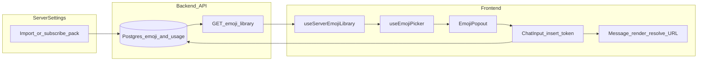

# Custom emoji and server packs — executive plan and specification

This document extends **[EMOJI_LOADING.md](./EMOJI_LOADING.md)**, which covers **unicode / Twemoji** loading, caching, search index, and picker performance. Here we specify **custom emojis**, **server-subscribed packs**, **usage-based ordering**, **personal packs (later)**, and how they integrate with the chat picker, autocomplete, message rendering, and permissions.

---

## Part A — Executive plan

### Problem

- The chat **emoji picker** ([`useEmojiPicker`](../../frontend/src/composables/useEmojiPicker.ts), [`EmojiPopout`](../../frontend/src/features/chat/components/EmojiPopout.vue)) only surfaces **unicode** categories from [`useEmojiData`](../../frontend/src/composables/useEmojiData.ts). It does not load **server** custom emojis or **subscribed/imported packs**.
- **Server Settings → Emoji** ([`useServerSettingsEmoji`](../../frontend/src/features/server-settings/composables/useServerSettingsEmoji.ts)) uses **mock** `serverEmojiPacks` for much of the UI; market listing exists ([`GET /emoji-market/packs`](../../backend/src/domain/echoEmojiMarket.ts)) but is not tied to a persisted server library consumed by the picker.
- **Recently used** ([`useRecentlyUsedEmojis`](../../frontend/src/composables/useRecentlyUsedEmojis.ts)) is **global**, stores unicode-oriented entries, and does not include **custom** emoji tokens or **per-server** scope.

### Goal (product)

**Target** behavior for Echo:

1. **Recently used** — always **first** in the picker; includes **unicode + server custom** (and later **personal** custom).
2. **Server packs** — section(s) for emojis available on the **current server** via **subscription / import**; within each pack, sort emojis by **use count** (server-scoped). Clear **per-pack** grouping (pack name as subheader).
3. **Personal packs** — same UX pattern **later**; keep a **placeholder** or empty section in the spec so the picker layout does not require a redesign.
4. **Unicode** — existing Twemoji categories remain **below** the above.

**Insert / storage:** use **linkable** tokens already defined in [`idTokens.ts`](../../frontend/src/utils/idTokens.ts): `<:name:snowflake>` (static) and `<a:name:snowflake>` (animated).

### Phases (delivery order)

| Phase | Focus                                                                                                                                                                                                                                                                                                                        |
| ----- | ---------------------------------------------------------------------------------------------------------------------------------------------------------------------------------------------------------------------------------------------------------------------------------------------------------------------------- |
| **1** | **Backend:** Persist server pack subscriptions + emoji metadata (URLs or storage keys); maintain **per-server, per-emoji usage** counts; expose **`GET …/servers/:serverId/emoji-library`** returning packs with emojis **sorted by use** (then name). Wire **Server Settings** emoji UI to real APIs instead of mock packs. |
| **2** | **Picker row model:** Extend or union `EmojiEntry` so a row can be **image + insert token** (not only unicode `emoji` string). Update [`EmojiCategorySection`](../../frontend/src/components/EmojiCategorySection.vue) (and related) to render `` for custom rows and emit the **token** on pick.                       |
| **3** | **`useEmojiPicker` + `EmojiPopout`:** Inject **`serverId`** from chat context; add `useServerEmojiLibrary` (fetch + cache); **merge** categories: Recent → Server packs (subsections per pack) → Personal placeholder → unicode.                                                                                             |
| **4** | **Recents:** Bump localStorage schema; store unicode + custom (token, id, name, preview URL, **serverId**); filter/display by current server where appropriate.                                                                                                                                                              |
| **5** | **Search + autocomplete:** Merge unicode search ([`useEmojiSearchIndex`](../../frontend/src/composables/useEmojiSearchIndex.ts)) with **custom name** search; extend [`useEmojiAutocomplete`](../../frontend/src/composables/useEmojiAutocomplete.ts) for `:slug:` completion including server custom names → insert token.  |
| **6** | **Rendering + reactions:** Message pipeline resolves `<:name:id>` to **image URL**; reactions using custom ids resolve the same way; enforce **`useExternalEmoji`** (and related) from [channel settings types](../../frontend/src/features/channel-settings/types.ts).                                                      |
| **7** | **Personal packs:** `GET …/users/me/emoji-library` (or equivalent); picker section **“Your packs”**; recents may tag `source: personal`.                                                                                                                                                                                     |

### Decisions to lock early

- **CDN vs Echo-proxied assets** — Direct URLs vs signed/proxied routes (import pipeline, Discord export bot assets, uploads).
- **Picker nav** — One sidebar icon for “This server” vs **one icon per pack** (Discord varies by client).
- **Animated format** — GIF vs WebP/APNG; same endpoint rules as static or separate.

### Success criteria (MVP)

- In a server with subscribed packs, opening the emoji popout shows **Recent** (if any), then **server pack** grids **sorted by use**, then unicode.
- Choosing a custom emoji **inserts** a valid `<:name:id>` / `<a:name:id>` string into the composer.
- **Strict mode optional:** no custom insert in channels where **Use external emoji** (or Echo’s equivalent) is denied.

### After this doc

- Use **Part A** for prioritization and status checkpoints.
- Use **Part B** as the implementation spec; **update this file** when decisions change—avoid duplicating long specs elsewhere.

---

## Part B — Detailed specification

### B.1 Current state (reference)

| Area                       | Location                                                                                                                                | Notes                                                                                     |
| -------------------------- | --------------------------------------------------------------------------------------------------------------------------------------- | ----------------------------------------------------------------------------------------- |
| Unicode categories + cache | [`useEmojiData.ts`](../../frontend/src/composables/useEmojiData.ts)                                                                     | `EmojiEntry`, `EmojiCategory`, localStorage `echo-emoji-v2`                               |
| Picker UI + category order | [`useEmojiPicker.ts`](../../frontend/src/composables/useEmojiPicker.ts)                                                                 | Recent + `getEmojiCategories()`, search branch                                            |
| Popout mount               | [`EmojiPopout.vue`](../../frontend/src/features/chat/components/EmojiPopout.vue)                                                        | Calls `ensureEmojiCategoriesLoaded`, `handleInsert(entry.emoji)` — **unicode only** today |
| Recents                    | [`useRecentlyUsedEmojis.ts`](../../frontend/src/composables/useRecentlyUsedEmojis.ts)                                                   | `echo-emoji-recent-v2`, `CachedEmojiEntry`                                                |
| Search index               | [`useEmojiSearchIndex.ts`](../../frontend/src/composables/useEmojiSearchIndex.ts)                                                       | Prebuilt + runtime; unicode only                                                          |
| Composer `:slug:`          | [`useEmojiAutocomplete.ts`](../../frontend/src/composables/useEmojiAutocomplete.ts)                                                     | `searchEmojisBySlugPrefix`                                                                |
| Server settings emoji      | [`useServerSettingsEmoji.ts`](../../frontend/src/features/server-settings/composables/useServerSettingsEmoji.ts)                        | Mock packs + market fetch                                                                 |
| Market catalog API         | [`echoEmojiMarket.ts`](../../backend/src/domain/echoEmojiMarket.ts), [`echoPublic.ts`](../../backend/src/api/routes/echo/echoPublic.ts) | `GET /emoji-market/packs`                                                                 |
| Custom token helpers       | [`idTokens.ts`](../../frontend/src/utils/idTokens.ts)                                                                                   | `linkTokenCustomEmoji`, `linkTokenCustomEmojiAnimated`, parse `<:…:>` / `<a:…:>`          |

### B.2 Data contract: custom emoji in the picker

- **Display:** `` (or shared component) with `src` from API **URL** (or Echo CDN). Alt text = `:name:` or name for a11y.
- **Insert value:** **always** the canonical token string, **not** the unicode codepoint.
- **Suggested TypeScript shape** (illustrative):

```ts
type PickerEmojiRow =
  | { kind: 'unicode'; entry: EmojiEntry }
  | {
      kind: 'custom';
      id: string;
      name: string;
      animated: boolean;
      imageUrl: string;
      packId: string;
      packName: string;
      source: 'server' | 'personal';
      insert: string; // <:name:id> or <a:name:id>
    };
```

Internal “category” for picker can remain `EmojiCategory`-like with `emojis` carrying a normalized row type, or parallel arrays—choose one pattern and use it in `EmojiCategorySection`.

### B.3 Backend sketch (server scope)

**Persistence (conceptual tables — names indicative):**

- **Pack subscription:** `server_id`, `pack_id` (market id or Echo-owned pack id), metadata, `subscribed_at`.
- **Emoji rows:** `id` (snowflake), `pack_id` or `server_id`, `name`, `animated`, `storage_key` or `url`.
- **Usage:** `(server_id, emoji_id) → use_count`, incremented on message send containing that emoji id and/or reaction add (batch/debounce acceptable).

**API:**

- `GET /api/v1/.../servers/:serverId/emoji-library`
  - Auth + guild membership.
  - Response: `{ packs: Array<{ packId, packName, source, emojis: Array<{ id, name, animated, url }> }> }`
  - Each pack’s `emojis` sorted by **`use_count` descending**, then `name` ascending.

**Settings integration:** Import/subscribe actions in Server Settings mutate the same persistence the library reads.

**Personal (phase 7):** `GET .../users/me/emoji-library` with the same pack shape; optional subscription/billing gate on `pack_id`.

### B.4 Frontend: `useServerEmojiLibrary`

- **Input:** `Ref<string | undefined>` for `serverId`.
- **Behavior:** Fetch `emoji-library` when `serverId` set; **SWR / short TTL** cache to limit requests on every popout open; expose `packs`, `loading`, `error`, `refresh`.
- **No server / DM:** Skip fetch; only unicode + personal (when implemented) + recents filtered appropriately.

### B.5 Picker category order (`useEmojiPicker`)

Computed `browsingCategories` (when not searching) should become:

1. **Recently used** — existing slug `recently-used`, populated from extended recents (unicode + custom for current context).
2. **Server packs** — either:
   - **Option A:** One nav entry “This server” scrolling to a region containing **subsections** (one header per pack + grid), or
   - **Option B:** One nav entry **per pack** (dense list), each scrolling to that pack’s grid.
3. **Personal packs** — placeholder empty category or “Coming soon” until phase 7.
4. **Unicode** — existing groups from `getEmojiCategories()`.

**Search mode:** Single “Search results” (or split “Unicode” / “Custom”) merging unicode hits from `searchEmojis` with custom name matches from current server (and personal) library up to a cap.

**Phase 1 / 2 performance:** Keep existing two-phase open behavior where possible; lazy-load custom library after first paint if needed.

### B.6 Recently used (storage)

- New key e.g. `echo-emoji-recent-v3` (or version bump in key).
- Store entries that can represent:
  - Unicode: existing `{ emoji, name, slug, html }`
  - Custom: `{ type: 'custom', insert, id, name, imageUrl, serverId?, source?: 'server'|'personal' }`
- **Picker filter:** When `serverId === X`, show recents relevant to X (custom used in X + global unicode strategy—product choice: merge or separate lists).
- **`addRecentlyUsed`:** Called from popout with full metadata when user picks custom row.

### B.7 Autocomplete and search

- **`useEmojiAutocomplete`:** After `ensureEmojiSearchPrebuildLoaded`, also consult **in-memory** list of `{ slug: normalizedName, insert }` for server custom emojis (prefix match on `name`).
- **Picker search:** Filter custom emojis by substring on `name` (case-insensitive) alongside unicode index.

### B.8 Message rendering and reactions

- **Parse** tokens in message body (reuse / align with [`idTokens`](../../frontend/src/utils/idTokens.ts) parsing).
- **Resolve** `id` → URL via config map, batch API, or embedded URL in token payload (avoid trusting client-only URLs from untrusted content—prefer server-resolved URL in API responses for messages).
- **Reactions:** If custom reaction keys are `emoji_id` or token, same resolver.
- **Permissions:** Before insert and when rendering, check channel/server **Use external emoji** (or Echo equivalent).

### B.9 Personal packs (deferred)

- Same API shape as server library; picker section below server or below recents per UX review.
- Recents may include `source: 'personal'`; optional separate LRU per user.

### B.10 Risks

- **Storage size** for large packs in memory + recents cap.
- **Rate limits** if usage tracking POSTs per keystroke—use debounce/batch.
- **Security:** Sanitize `imageUrl` or only allow Echo-issued URLs in rendered messages.

### B.11 Data flow (mermaid)



---

## Document history

- **2026-03-25** — Initial executive + detailed spec (custom emoji, server packs, personal placeholder).
